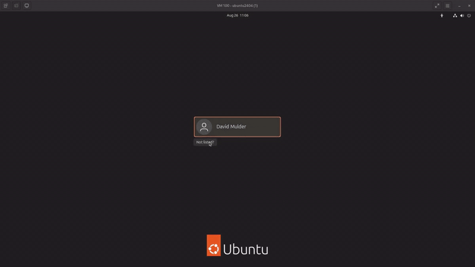
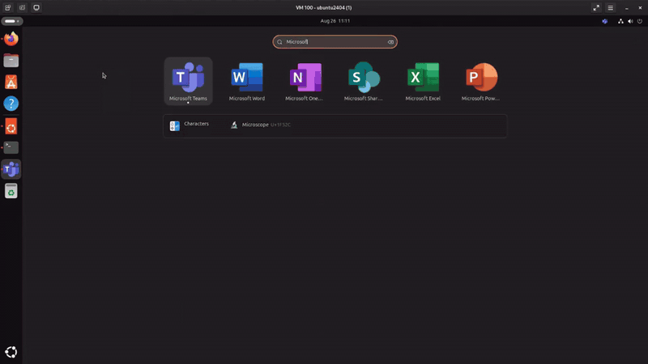

<section class="home-hero">
  

    <a href="https://www.heise.de/select/ix/2026/1/2528006422371218161" target="_blank" rel="noopener" class="press-float">
      Featured In
      
      iX Magazine
    </a>
    <aside class="hb-donate-banner" id="hb-donate-banner" role="region" aria-label="Support Himmelblau">
      

        

          Help me keep the lights on.
          Contributions fund the hardware, travel, and support work behind the scenes.
        

        

          <a class="hb-donate-banner__cta" href="https://opencollective.com/himmelblau/contribute/sponsors-84876/checkout" target="_blank" rel="noopener">Contribute</a>
          <button class="hb-donate-banner__dismiss" type="button" aria-label="Dismiss donation banner">Maybe later</button>
        

      

    </aside>
  

  

    <h1>Seamless Azure Entra ID and Intune integration for Linux</h1>
    
SSO, MFA, Intune compliance and TPM-backed keys — with a cleaner experience than Windows.

    

      <a href="/downloads/index.html" class="md-button md-button--primary">Download Himmelblau for Linux</a>
      <a href="/community" class="md-button">Join the Community</a>
    

  

</section>

<section class="capabilities">

  

  <figure id="gif-login" class="hb-slide">
    <a class="hb-prev" href="#gif-o365" aria-label="Previous">‹</a>
    <a class="hb-next" href="#gif-display-manager"  aria-label="Next">›</a>

    
    <figcaption><strong>Join &amp; Hello Enroll</strong> 
      Device join and Hello for Business key provisioning.
    </figcaption>
  </figure>

  <figure id="gif-display-manager" class="hb-slide">
    <a class="hb-prev" href="#gif-login" aria-label="Previous">‹</a>
    <a class="hb-next" href="#gif-nss"  aria-label="Next">›</a>

    
    <figcaption><strong>Display Manager</strong> 
      Himmelblau Display Manager — a GDM replacement with native Entra ID and OIDC support. Currently experimental.
    </figcaption>
  </figure>

  <figure id="gif-nss" class="hb-slide">
    <a class="hb-prev" href="#gif-display-manager"   aria-label="Previous">‹</a>
    <a class="hb-next" href="#gif-firefox" aria-label="Next">›</a>

    
    <figcaption><strong>Identity Lookup</strong> 
      Linux <code>id</code> and <code>getent</code> integrated with Entra ID via NSS.
    </figcaption>
  </figure>

  <figure id="gif-firefox" class="hb-slide">
    <a class="hb-prev" href="#gif-nss"  aria-label="Previous">‹</a>
    <a class="hb-next" href="#gif-o365" aria-label="Next">›</a>

    
    <figcaption><strong>Browser SSO</strong> 
      Seamless sign-on in Firefox with PRT-based authentication.
    </figcaption>
  </figure>

  <figure id="gif-o365" class="hb-slide">
    <a class="hb-prev" href="#gif-firefox" aria-label="Previous">‹</a>
    <a class="hb-next" href="#gif-login"   aria-label="Next">›</a>

    
    <figcaption><strong>Office 365 Web Apps</strong> 
      Single sign-on across Outlook, Teams, and OneDrive.
    </figcaption>
  </figure>

    <nav class="hb-dots" aria-label="Choose slide">
      <a href="#gif-login"   aria-label="Join & Hello Enroll">•</a>
      <a href="#gif-display-manager" aria-label="Display Manager">•</a>
      <a href="#gif-nss"     aria-label="Identity Lookup">•</a>
      <a href="#gif-firefox" aria-label="Browser SSO">•</a>
      <a href="#gif-o365"    aria-label="O365 Web Apps">•</a>
    </nav>
  

</section>
