

  <section class="hb-hero" aria-labelledby="hb-hero-title">
    

      <h1>Cloud identity for Linux</h1>
      
SSO, MFA, compliance, and TPM-backed keys across Entra ID/Intune and OIDC providers such as Keycloak and Okta — with a practical path toward sovereign cloud identity.

      

        <a class="hb-button hb-button--primary" href="#install" data-hb-event="hero-install">Start installation</a>
        <a class="hb-button hb-button--ghost" href="#ssh">See how it works ↓</a>
      

    

    <a class="hb-scroll-cue" href="#identity-gap">Scroll to explore<i aria-hidden="true"></i></a>
  </section>

  <section class="hb-statement" aria-labelledby="identity-gap-title">
    

      
One identity plane

      <h2 id="identity-gap-title">Your cloud identity should follow users to every Linux session.</h2>
      
Remote servers and graphical workstations are different security contexts. Himmelblau gives each the right authentication experience while connecting both to the same Entra ID, PAM, and NSS foundation.

      

        <a href="#ssh">⌁<strong>Remote access</strong><small>Cloud credentials + native MFA</small></a>
        <a href="#desktop">◉<strong>Desktop access</strong><small>Device-bound Hello PIN</small></a>
      

    

  </section>

  <section class="hb-chapter hb-chapter--ink" aria-labelledby="ssh-title">
    <header class="hb-chapter__header hb-shell hb-anchor-target" id="ssh">
      
For administrators

      <h2 id="ssh-title">MFA-secured SSH, directly against your cloud identity.</h2>
      
Resolve Entra or OIDC users through NSS, authenticate through PAM, complete the tenant’s MFA challenge, and enter the shell. Remote sessions require MFA by default.

    </header>

    

      

        
<b>ssh tux@192.168.1.73</b>

        

          <figure class="hb-frame is-active" data-hb-frame></figure>
          <figure class="hb-frame" data-hb-frame></figure>
          <figure class="hb-frame" data-hb-frame></figure>
          <figure class="hb-frame" data-hb-frame></figure>
        

      

      

        <article class="hb-step is-active" data-hb-step>
          01<h3>Connect as a Cloud user</h3>
          
Himmelblau resolves the cloud identity as a Linux account through NSS—without pre-creating a local user.

        </article>
        <article class="hb-step" data-hb-step>
          02<h3>Authenticate with the Identity Provider</h3>
          
PAM hands the request to Himmelblau. The exact credential flow follows the authentication methods configured by the Identity Provider.

        </article>
        <article class="hb-step" data-hb-step>
          03<h3>Complete native MFA</h3>
          
MFA happens inside the SSH experience.

        </article>
        <article class="hb-step" data-hb-step>
          04<h3>Enter the shell</h3>
          
The authenticated cloud identity arrives as a normal POSIX session, ready for shared hosts, remote administration, and group-based access control.

        </article>
      

    

  </section>

  <section class="hb-chapter hb-chapter--mist" aria-labelledby="desktop-title">
    <header class="hb-chapter__header hb-shell hb-anchor-target" id="desktop">
      
For workstations

      <h2 id="desktop-title">The first desktop login becomes a secure daily habit.</h2>
      
Users establish their identity, satisfy MFA, and enroll a Hello PIN bound to that Linux device. Linux Hello can optionally be disabled, requiring MFA at every desktop login.

    </header>

    

      

        

          <figure class="hb-frame is-active" data-hb-frame>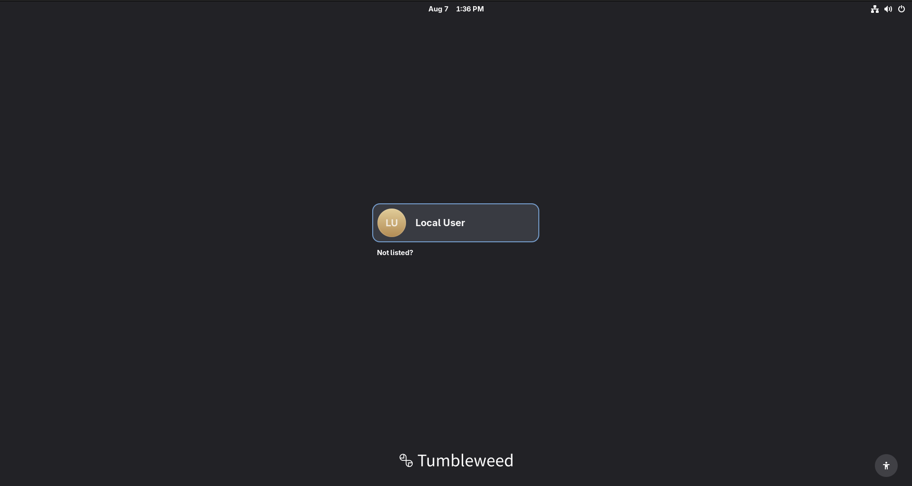</figure>
          <figure class="hb-frame" data-hb-frame>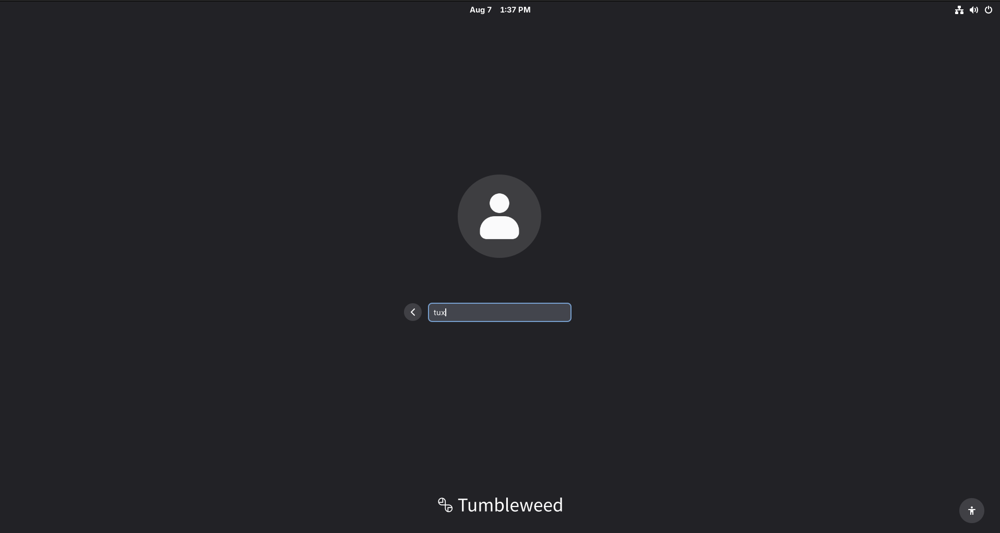</figure>
          <figure class="hb-frame" data-hb-frame>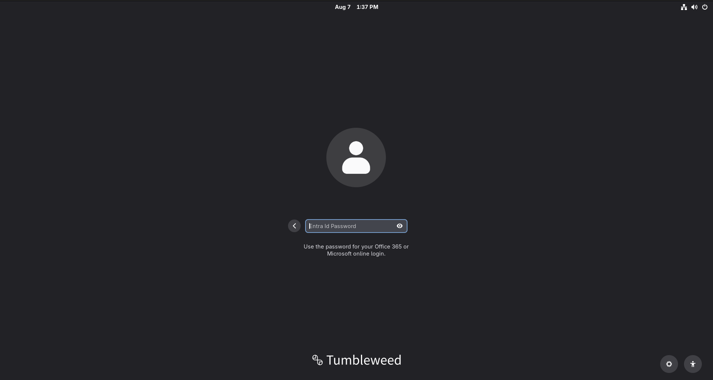</figure>
          <figure class="hb-frame" data-hb-frame>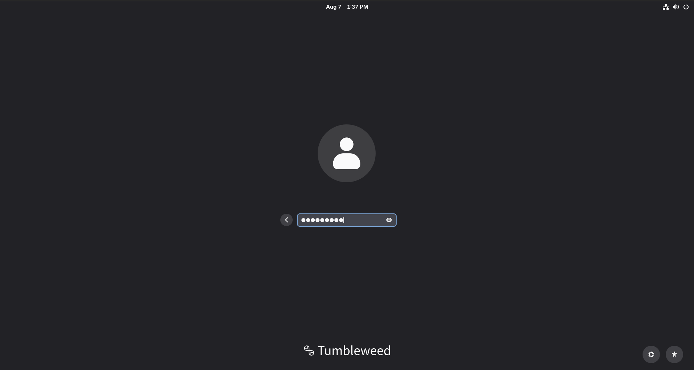</figure>
          <figure class="hb-frame" data-hb-frame>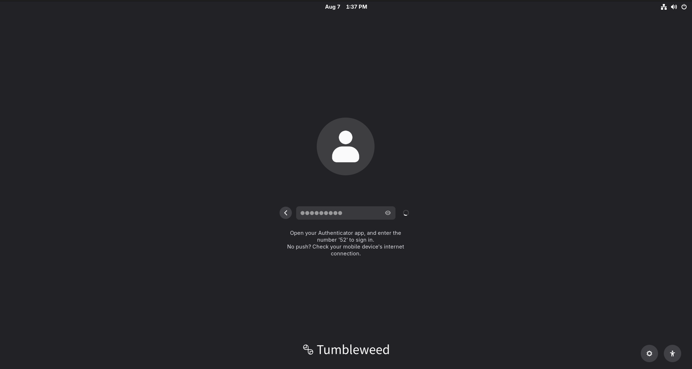</figure>
          <figure class="hb-frame" data-hb-frame></figure>
          <figure class="hb-frame" data-hb-frame>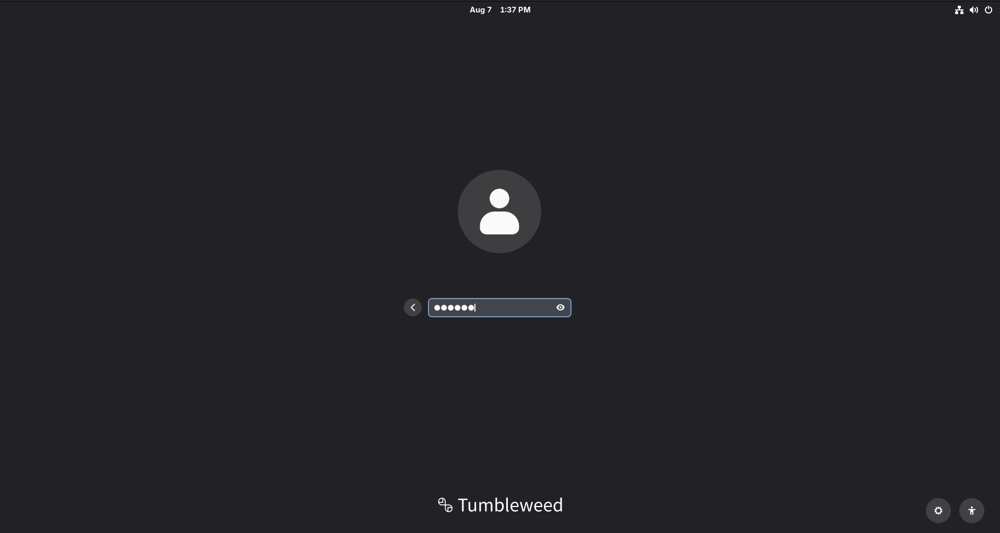</figure>
          <figure class="hb-frame" data-hb-frame>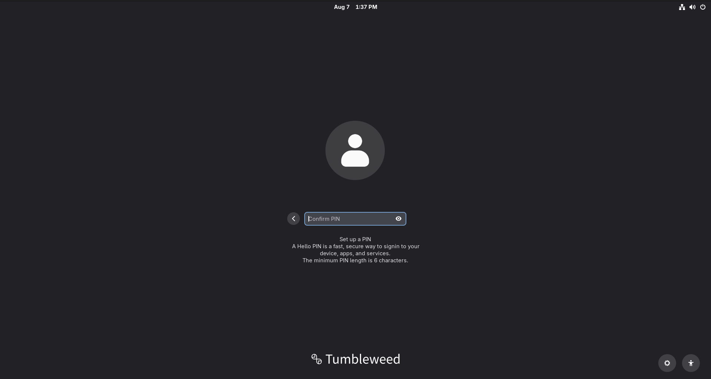</figure>
          <figure class="hb-frame" data-hb-frame>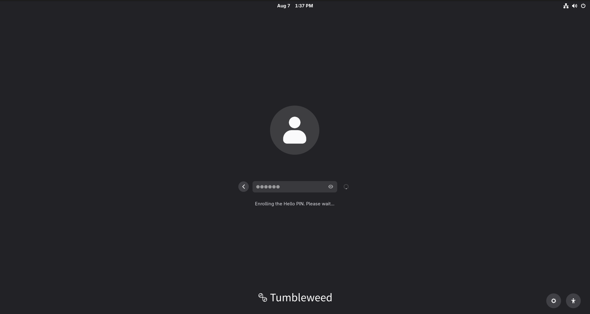</figure>
          <figure class="hb-frame" data-hb-frame>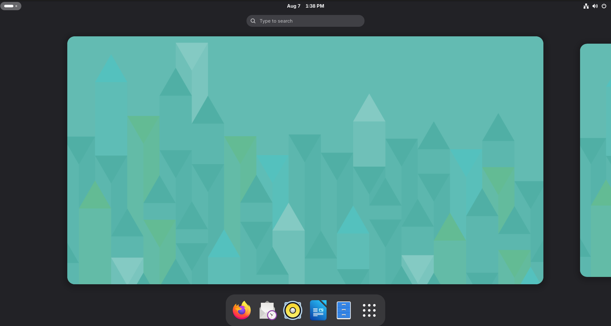</figure>
        

      

      

        <article class="hb-step is-active" data-hb-step>01<h3>Choose the cloud account</h3>
“Not listed?” opens a prompt for entering your Cloud identity username.
</article>
        <article class="hb-step" data-hb-step>02<h3>Establish identity</h3>
The user signs in with their Cloud credentials and the tenant’s configured authentication requirements.
</article>
        <article class="hb-step" data-hb-step>03<h3>Satisfy MFA</h3>
Native MFA is presented at the Linux greeter, keeping the first-login journey in one coherent flow.
</article>
        <article class="hb-step" data-hb-step>04<h3>Enroll a Hello PIN</h3>
The PIN unlocks a cryptographic credential tied to this device. With a hardware TPM configured, key material can be hardware-backed.
</article>
        <article class="hb-step" data-hb-step>05<h3>Start the session</h3>
The desktop opens as the Cloud user, with the identity and token foundation needed by browser and application SSO.
</article>
      

    

  </section>

  <section class="hb-chapter hb-chapter--return" aria-labelledby="return-title">
    <header class="hb-chapter__header hb-shell">
        
The next login

        <h2 id="return-title">Enroll once. Return with the device-bound PIN.</h2>
        
Hello PIN is intended for local authentication by default: convenient at the workstation, without weakening the remote SSH boundary.

    </header>
    

      

        

          <figure class="hb-frame is-active" data-hb-frame>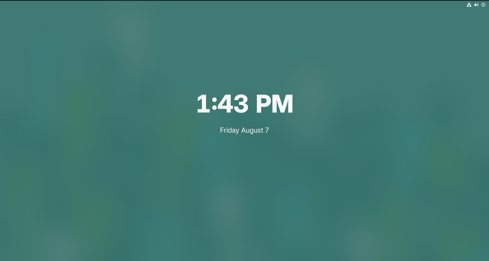</figure>
          <figure class="hb-frame" data-hb-frame></figure>
          <figure class="hb-frame" data-hb-frame>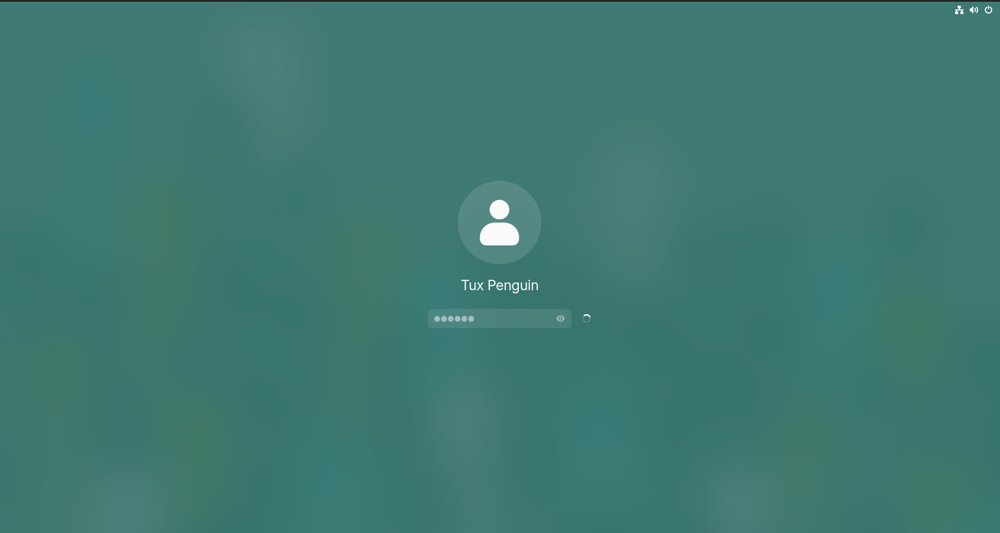</figure>
          <figure class="hb-frame" data-hb-frame>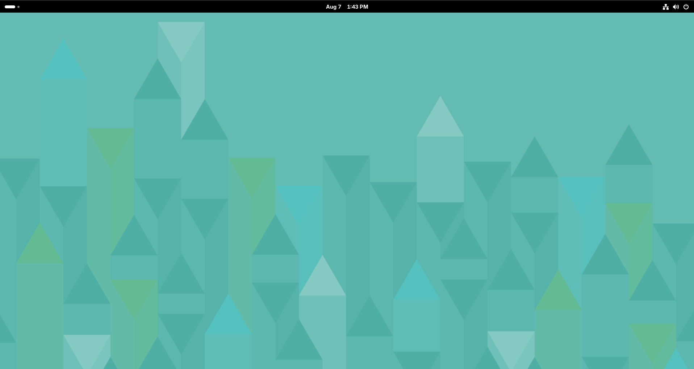</figure>
        

      

      

        <article class="hb-step is-active" data-hb-step>01<h3>Wake the workstation</h3>
Return to the familiar local lock screen on the enrolled Linux device.
</article>
        <article class="hb-step" data-hb-step>02<h3>Enter the device-bound PIN</h3>
The user authenticates locally with the Hello PIN enrolled during their first sign-in.
</article>
        <article class="hb-step" data-hb-step>03<h3>Unlock the protected credential</h3>
Himmelblau validates the PIN and unlocks the cryptographic credential bound to this device.
</article>
        <article class="hb-step" data-hb-step>04<h3>Continue the workday</h3>
The desktop opens with native SSO integration.
</article>
      

    

  </section>

  <section class="hb-chapter hb-chapter--cloud" aria-labelledby="sso-title">
    <header class="hb-chapter__header hb-shell hb-anchor-target" id="sso">
      
The session continues

      <h2 id="sso-title">Sign in to Linux. Open the workday already authenticated.</h2>
      
The authenticated session can carry SSO into Firefox, Thunderbird, and Microsoft 365 web applications, while packaged launchers make the suite feel at home on the desktop.

    </header>
    

      

        

          <figure class="hb-frame is-active" data-hb-frame>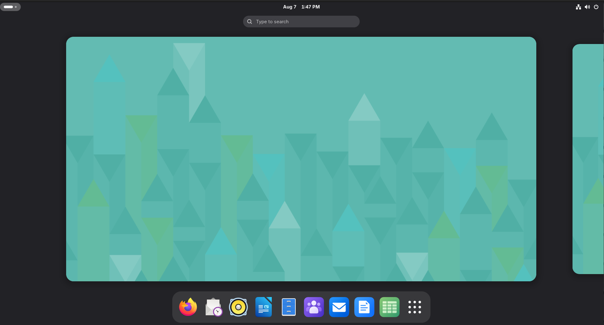</figure>
          <figure class="hb-frame" data-hb-frame>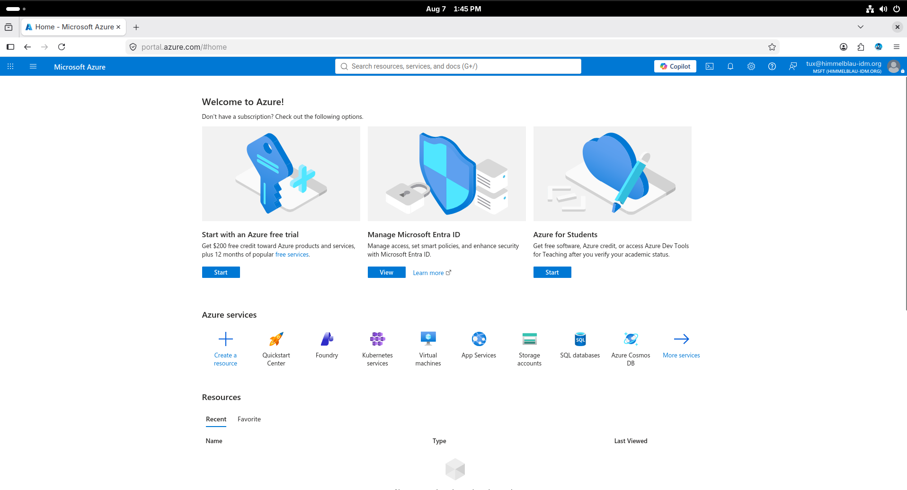</figure>
          <figure class="hb-frame" data-hb-frame>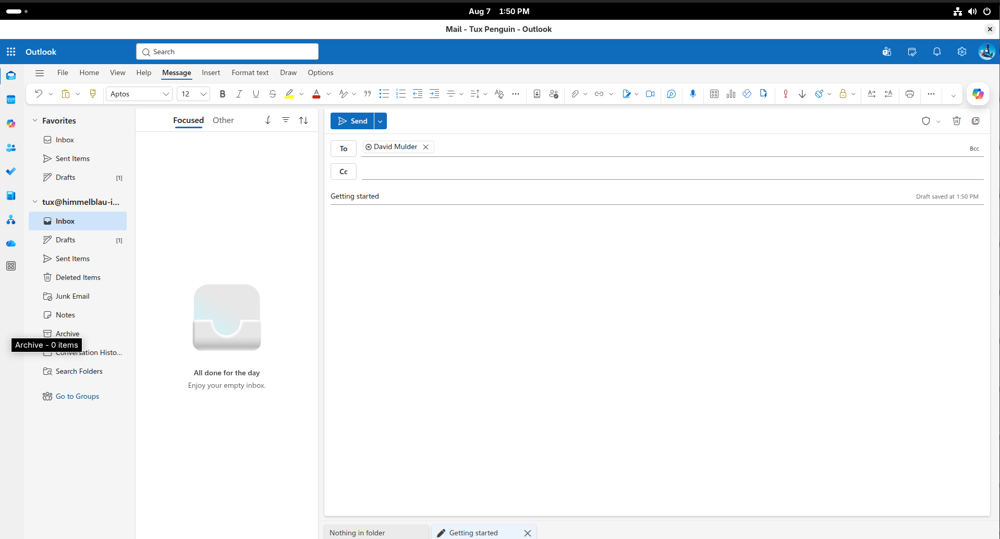</figure>
          <figure class="hb-frame" data-hb-frame>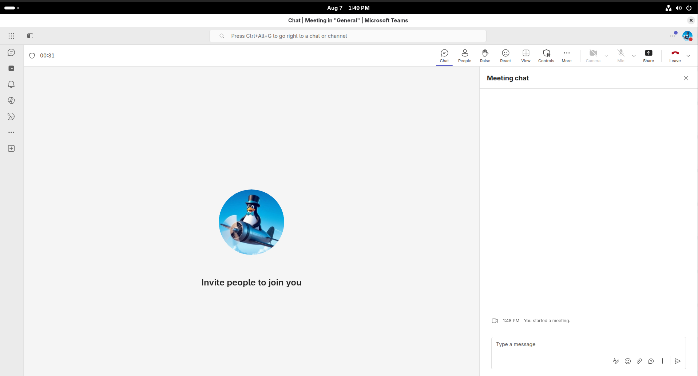</figure>
          <figure class="hb-frame" data-hb-frame>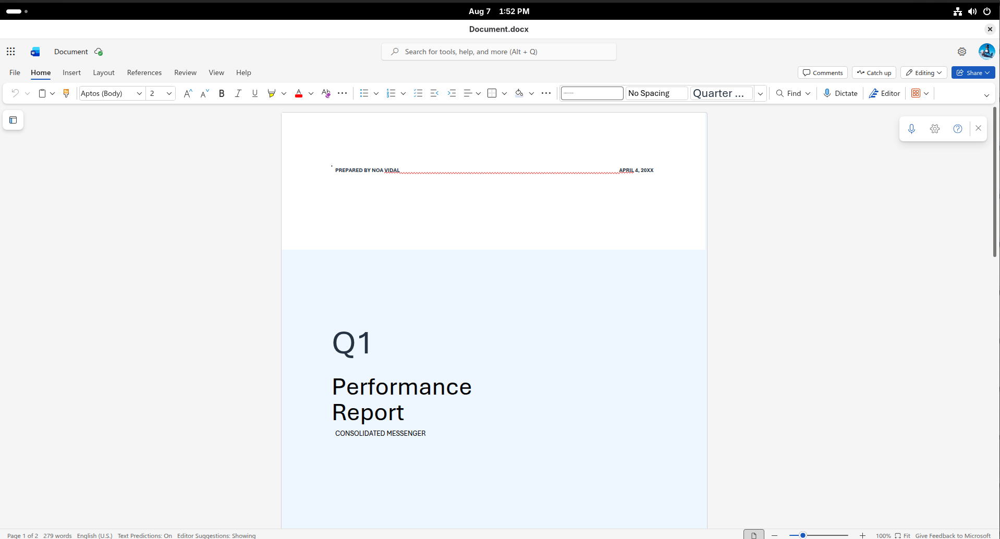</figure>
          <figure class="hb-frame" data-hb-frame>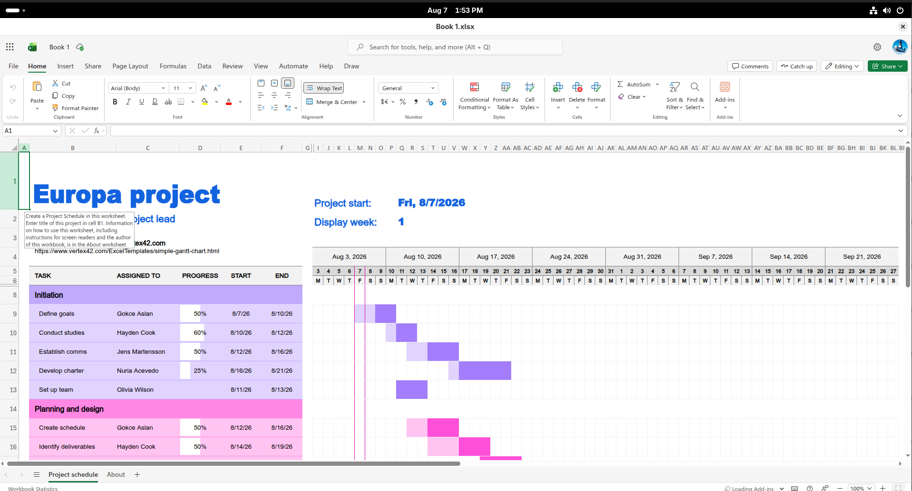</figure>
          <figure class="hb-frame" data-hb-frame></figure>
        

      

      

        <article class="hb-step is-active" data-hb-step>01<h3>Applications feel native</h3>
Launch Outlook, Teams, Word, Excel, and PowerPoint from the desktop rather than rebuilding the workday around browser tabs.
</article>
        <article class="hb-step" data-hb-step>02<h3>Browser SSO</h3>
PRT-based authentication lets supported browsers reach Entra-protected services without another full sign-in.
</article>
  <article class="hb-step" data-hb-step>
    03
    <h3>Outlook, already signed in</h3>
    
Open Outlook from the desktop and get straight to mail and calendar with the same authenticated identity.

  </article>

  <article class="hb-step" data-hb-step>
    04
    <h3>Meet in Teams</h3>
    
Join Teams meetings from Linux without breaking the flow of your desktop workspace.

  </article>

  <article class="hb-step" data-hb-step>
    05
    <h3>Work in Word</h3>
    
Create and edit Microsoft 365 documents while remaining connected to your Entra identity.

  </article>

  <article class="hb-step" data-hb-step>
    06
    <h3>Build in Excel</h3>
    
Work with spreadsheets from the Linux desktop without another round of authentication.

  </article>

  <article class="hb-step" data-hb-step>
    07
    <h3>Present with PowerPoint</h3>
    
Open presentations directly from the desktop and keep the Microsoft 365 workflow connected end to end.

  </article>
      

    

  </section>

  <section class="hb-compliance" aria-labelledby="compliance-title">
    

      

        
Intune integration

        <h2 id="compliance-title">Linux devices, visible and compliant.</h2>
        
Himmelblau brings Linux devices into the Intune view and can apply compliance at authentication time.

        <ul class="hb-checks"><li>Linux device registration</li><li>Compliance status in Intune</li><li>Policy enforcement during authentication</li></ul>
        <a class="hb-text-link" href="/docs/intune/">Explore Intune policy integration →</a>
      

      <figure class="hb-compliance__image">
        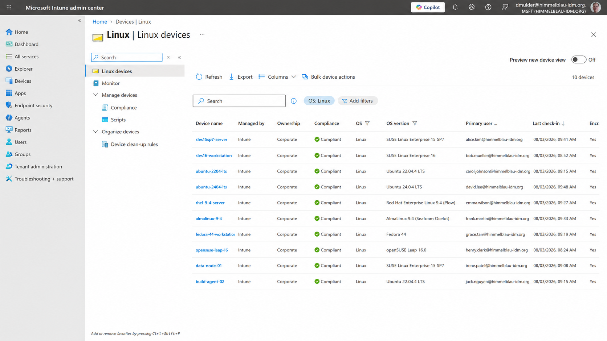
        <figcaption>Linux devices reporting compliant in the Intune admin center.</figcaption>
      </figure>
    

  </section>

  <section class="hb-proof" aria-labelledby="proof-title">
    

      <header class="hb-section-heading">
Trusted in the open
<h2 id="proof-title">Identity infrastructure you can inspect, test, and improve.</h2></header>
      

        <a class="hb-proof-card" href="https://github.com/himmelblau-idm/himmelblau" target="_blank" rel="noopener">GPLv3+<strong>Open source by design</strong>
Review the implementation, follow development, and contribute on GitHub.
</a>
        <a class="hb-proof-card" href="https://github.blog/open-source/maintainers/securing-the-ai-software-supply-chain-security-results-across-67-open-source-projects/" target="_blank" rel="noopener">Security program<strong>GitHub Secure Open Source Fund</strong>
Himmelblau participated in GitHub’s project security initiative.
</a>
        <article class="hb-proof-card hb-proof-card--patch">Security engineering<strong>Patch the Planet participant</strong>
Himmelblau is participating in the OpenAI and Trail of Bits initiative that pairs AI-assisted research with expert review to find, validate, and patch security issues in open-source software.

<a href="https://trailofbits.com/patch-the-planet/" target="_blank" rel="noopener">Program overview →</a><a href="https://openai.com/index/patch-the-planet/" target="_blank" rel="noopener">OpenAI announcement →</a>
</article>
      

      <a class="hb-press-strip" href="https://www.heise.de/select/ix/2026/1/2528006422371218161" target="_blank" rel="noopener"><small>Featured in iX Magazine</small><strong>Read independent technical coverage of Himmelblau.</strong><b aria-hidden="true">Read the article →</b></a>
      

Evaluating your options?
<h3>Compare Himmelblau with Authd, SSSD, and Intune for Linux.</h3>
<a class="hb-button hb-button--dark" href="/alternatives/">Compare solutions →</a>

    

  </section>

  <section class="hb-install" aria-labelledby="install-title">
    

      
Ready when you are

      <h2 id="install-title">Bring your Linux systems into the identity plane.</h2>
      
The guided installer uses the native package manager, configures the identity provider, and starts the Himmelblau services.

      
<code>curl -fsSL https://himmelblau-idm.org/install | sh</code><button type="button" data-hb-copy aria-label="Copy installation command">Copy</button>

      
Review scripts before running them in your environment.

      
<a class="hb-button hb-button--primary" href="/downloads/" data-hb-event="install-options">Package options</a><a class="hb-button hb-button--ghost-light" href="/docs/" data-hb-event="install-docs">Deployment documentation</a>

      
SUSEopenSUSEUbuntuMintDebianFedoraRHELRockyOracleAlmaAmazonNixOS

    

  </section>

  <section class="hb-close">
    

<strong>Built by and for the community.</strong>
Ask questions, report issues, help test, or support continued development.

<nav aria-label="Community links"><a href="/community/">Join the community</a><a href="https://github.com/himmelblau-idm/himmelblau" target="_blank" rel="noopener">GitHub</a><a href="/donations/">Support Himmelblau</a></nav>

  </section>

