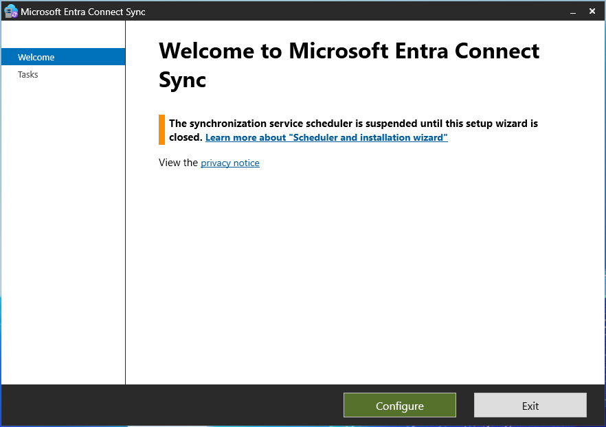
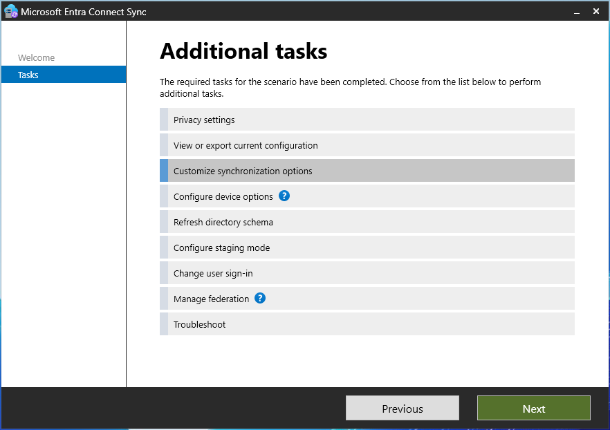
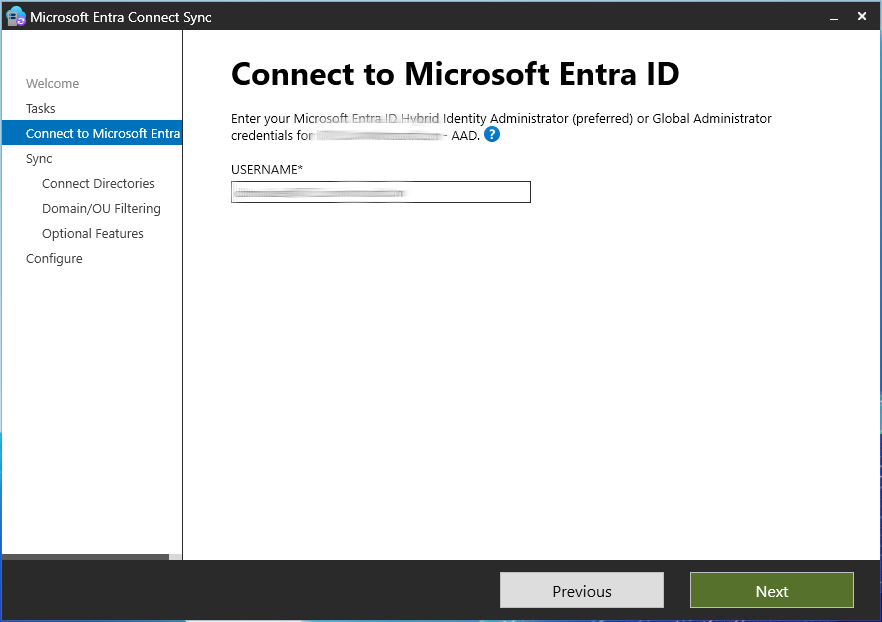
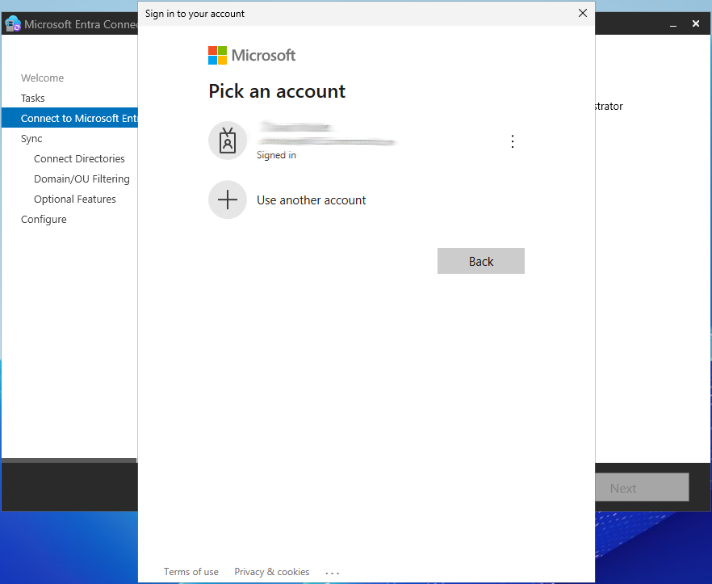
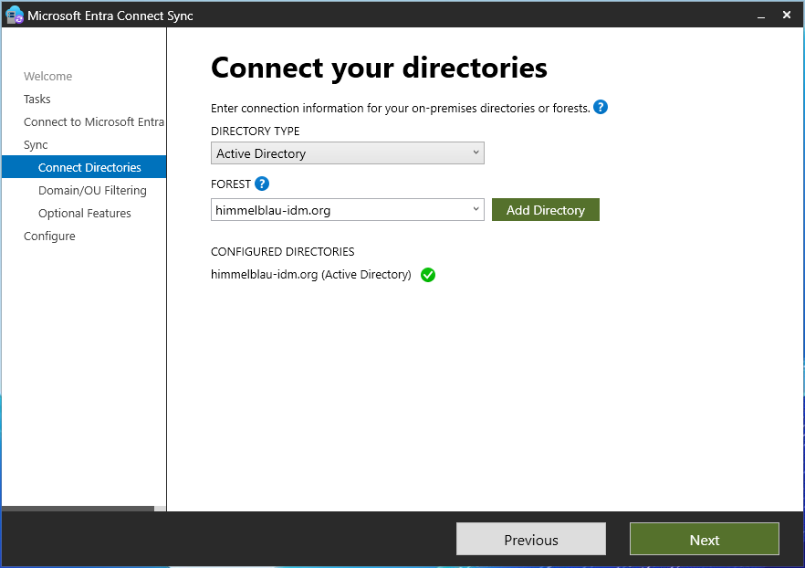
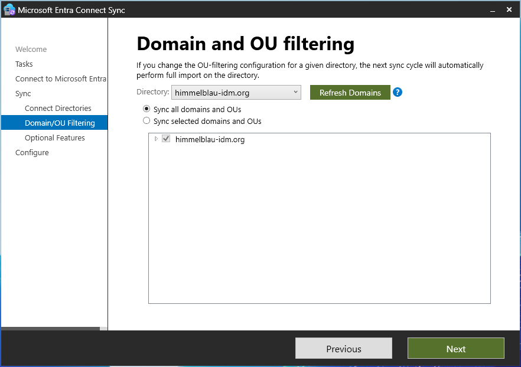
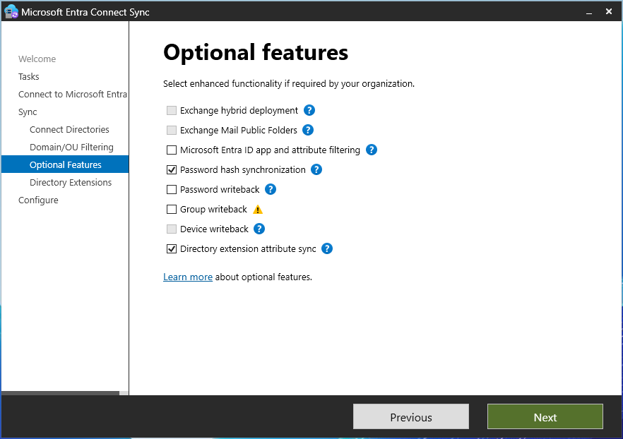
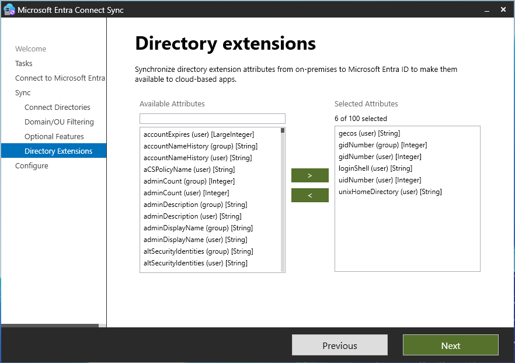
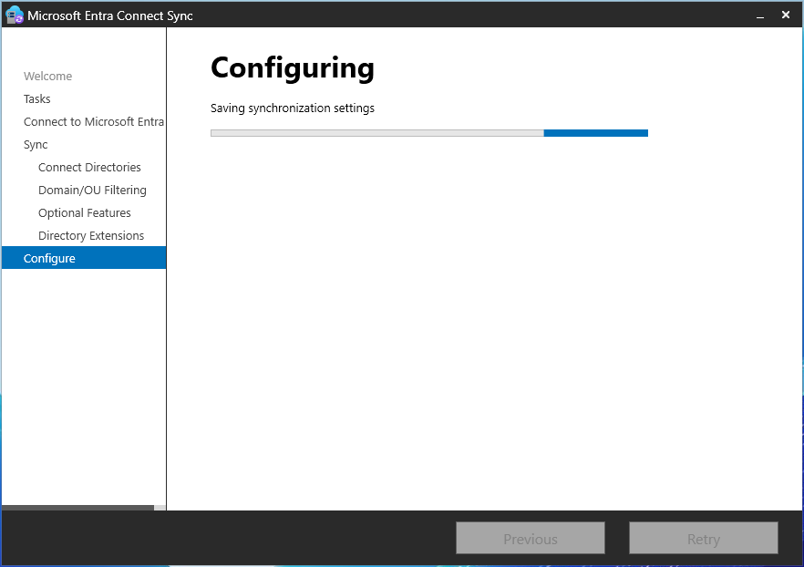
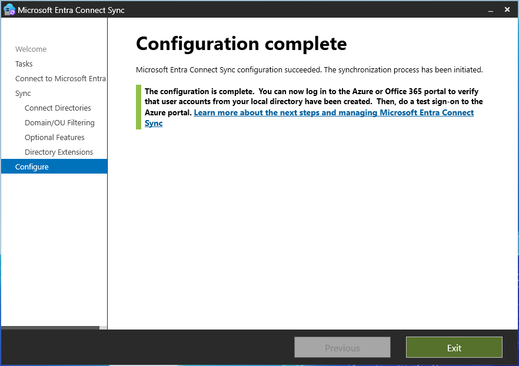

## **Overview**
This guide explains how to configure Microsoft Entra Connect Sync to synchronize Unix attributes (`uidNumber`, `gidNumber`, `loginShell`, `unixHomeDirectory`, etc.) from an on-premises Active Directory to an existing **Azure Entra ID** instance. This is essential for Linux authentication solutions like Himmelblau that rely on Unix attributes stored in AD.
This guide assumes that Microsoft Entra Connect is already installed and configured. If not, [follow the instructions in this wiki](https://github.com/himmelblau-idm/himmelblau/wiki/Syncing-Active-Directory-with-Azure-Entra-ID) to configure Microsoft Entra Connect.

---

## **Prerequisites**
- A **Windows Server** with **Active Directory Domain Services (AD DS)** installed and configured.
- A configured **Active Directory domain** with Unix attributes (`uidNumber`, `gidNumber`, `unixHomeDirectory`, `loginShell`, etc.) assigned to users and groups.
- An **Azure Entra ID** tenant.
- **[Microsoft Entra Connect Sync](https://www.microsoft.com/en-us/download/details.aspx?id=47594)** installed on a domain-joined Windows Server.

---

## **Step-by-Step Configuration**

### **1. Open Microsoft Entra Connect Sync**
1. Launch **Microsoft Entra Connect Sync** from the **Start Menu**.
2. Click **"Configure"** to begin.

---

### **2. Customize Synchronization Options**
1. Select **"Customize synchronization options"** and click **Next**.

---

### **3. Connect to Microsoft Entra ID**
1. Enter your **Azure Entra ID administrator credentials** (Global Admin or Hybrid Identity Admin).

2. Sign in when prompted.

---

### **4. Connect to Active Directory**
1. Verify that the on-premises **Active Directory domain (forest)** is connected.
2. Click **Next**.

---

### **5. Configure Domain and OU Filtering**
1. Choose whether to sync **all domains and OUs** or only specific OUs.
2. Click **Next**.

---

### **6. Enable Directory Extension Attribute Sync**
1. Ensure **"Directory extension attribute sync"** is **checked**.
2. Click **Next**.

---

### **7. Select Unix Attributes for Synchronization**
1. In the **Directory Extensions** step, select the following attributes:
   - **`uidNumber` (user)**
   - **`gidNumber` (user)** (the user's primary group attribute)
   - **`gidNumber` (group)**
   - **`loginShell` (user)**
   - **`unixHomeDirectory` (user)**
   - **`gecos` (user)** (optional, for additional Unix user details)
2. Click **Next**.

---

### **8. Configure and Apply Settings**
1. Click **Next** to save and apply the synchronization settings.
2. Wait for the configuration to complete.

---

### **9. Verify Configuration Completion**
1. Once the setup is completed, you’ll see a confirmation message.
2. Click **Exit**.

---

## **10. Validate Synchronization**
After the setup:

1. Open the [**Microsoft Entra Admin Center**](https://entra.microsoft.com).
2. Go to **Hybrid Management** → **Microsoft Entra Connect**.
3. Check the sync status and ensure that users have their **Unix attributes** synchronized.
