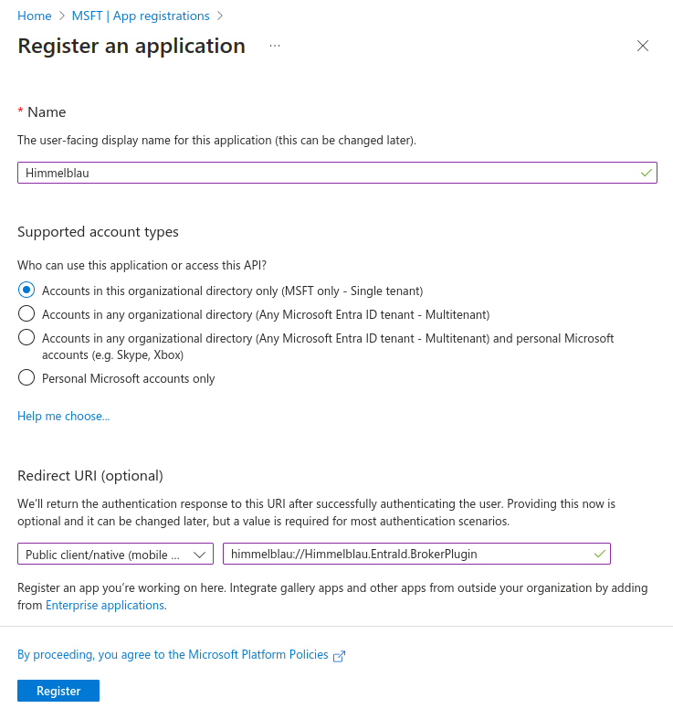
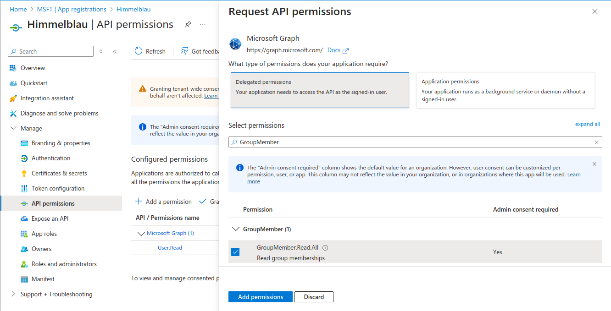
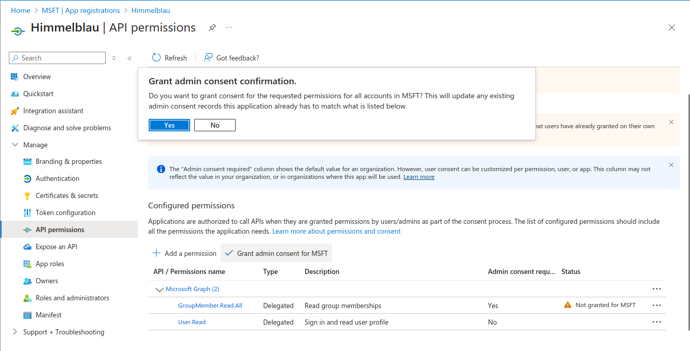

## Overview

Himmelblau requires additional API permissions to read group names and extended attributes such as a groups' `gidNumber` (which is essential for RFC2307 attribute ID mapping). The following instructions guide you through registering an Azure Entra ID application, assigning it permissions, and configuring Himmelblau to use either *delegated* or *confidential client* authentication.

With the default configuration, Himmelblau will attempt to resolve group memberships by masquerading as the Edge browser with **delegated access**, but this doesn't work in every tenant, and has the limitation of only resolving group memberships *after* each user has authenticated.

> **Note:**  
> - If you set up **confidential client credentials** (client secret or certificate) using `aad-tool cred`, you do **not** need to specify an `app_id` in `himmelblau.conf`.  
> - If you choose **delegated access**, you must set an `app_id` in your configuration.

## 1. Register a New Application in Azure Entra ID

1. Navigate to the [Azure Entra ID portal](https://portal.azure.com/#view/Microsoft_AAD_IAM/ActiveDirectoryMenuBlade/~/Overview).
2. In the left-hand menu, select **App registrations**.
3. Click **New registration**.
4. Enter a **Name** for the application (e.g., `Himmelblau`).
5. Under **Supported account types**, choose **Accounts in this organizational directory only**.
6. Under **Redirect URI**, choose **Public client/native (mobile & desktop)** for the **platform** and enter `himmelblau://Himmelblau.EntraId.BrokerPlugin` for the URI.
7. Click **Register**.



## 2. Assign API Permissions

1. In the newly created application, navigate to **API permissions**.
2. Click **Add a permission**.
3. Select **Microsoft Graph**.
4. If utilizing Confidential Client Credentials (Option A below) choose **Application permissions**, otherwise choose **Delegated permissions** (Option B).
5. Search for `GroupMember.Read.All` and select it.
6. Click **Add permissions**.



7. Click **Grant admin consent** to approve these permissions for your tenant.



### 3. Obtain the Application ID

1. Go to **Overview** in the application’s page.
2. Copy the **Application (client) ID**. This value will be used in Himmelblau’s configuration.

## 4. Configure Authentication in Himmelblau

You have two main options for enumerating users and group memberships:

---

### Option A: Using Confidential Client Credentials (Recommended)

This method stores a **client secret** or **client certificate** securely in Himmelblau’s encrypted cache and removes the need to specify an `app_id` in `himmelblau.conf`.

#### Store a client secret

```bash
aad-tool cred secret --client-id <CLIENT_ID> --domain <DOMAIN> --secret <SECRET_VALUE>
```

1. In the Entra ID portal, under **Certificates & secrets**, create a new **Client secret**.
2. Copy the **Value** immediately (you won’t see it again) and use it with the above command.

#### Or set up a client certificate

```bash
aad-tool cred cert --client-id <CLIENT_ID> --domain <DOMAIN> --valid-days 365 --cert-out /tmp/my-cert.crt
```

1. Upload `/tmp/my-cert.crt` in the Entra ID portal under **Certificates & secrets > Certificates**.

The private key never leaves your TPM or software HSM.

> **Note:** 
> These credentials expire, and you'll need to repeat these steps *each* time the credentials expire.

---

### Option B: Using Delegated Authentication

If you do **not** configure confidential client credentials, add your application ID to `himmelblau.conf` for delegated authentication.

```ini
[example.com]
app_id = 98fa618b-e5d2-4697-b0fd-fe3ec5eecdd3
```

Replace with your actual **Application (client) ID** found in the app’s **Overview** page.

> **Note:** 
> This method prevents the enumeration of rfc2307 attributes and group memberships until *after* each user authenticates. Utilizing the `aad-tool enumerate` command can improve attribute resolution, but will need to be performed each time a new user is added to the directory (or whenever their posix attributes are added/modified).

---

### 5. Restart Himmelblau Services

To apply changes, restart Himmelblau:

```bash
sudo systemctl restart himmelblaud
sudo systemctl restart himmelblaud-tasks
```

## 6. (Optional) Pre-cache UID/GID Mappings

You can optionally pre-fetch all users and groups with RFC2307 attributes:

```bash
aad-tool enumerate
```

This avoids lookups being triggered on first login.

## 7. Managing Credentials

* List stored credentials:

```bash
aad-tool cred list --domain <DOMAIN>
```

* Remove credentials if needed:

```bash
aad-tool cred delete --domain <DOMAIN>
```

## Conclusion

By following these steps, Himmelblau will be able to retrieve group information necessary for accurate ID mapping using Entra ID. Ensure that the application has the necessary permissions and is correctly configured in `himmelblau.conf` for seamless integration.
