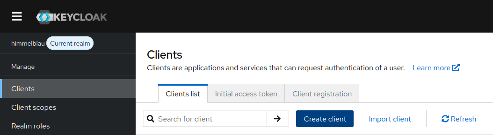
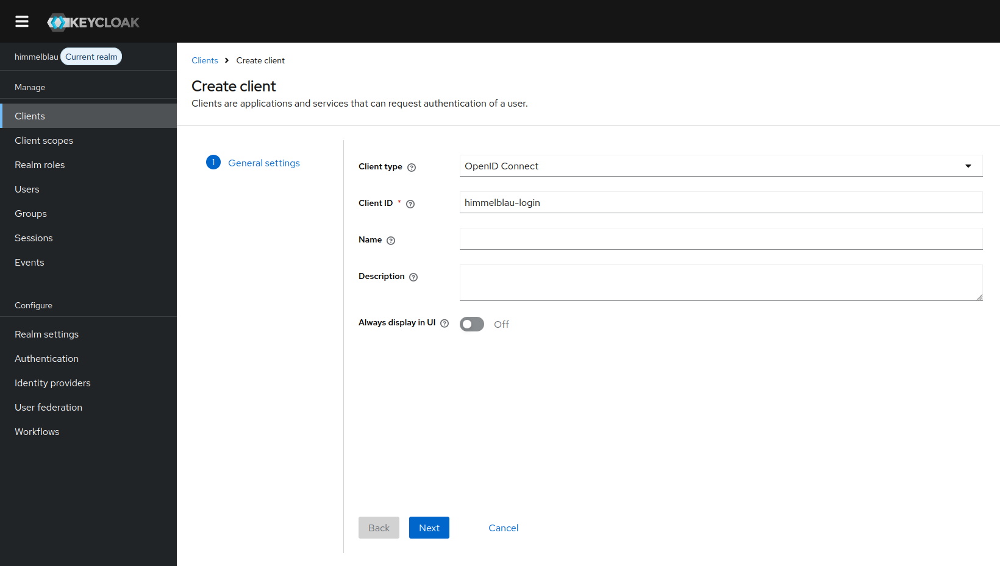
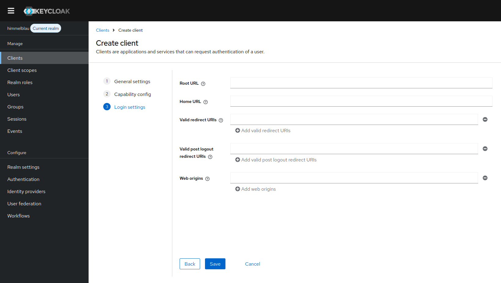
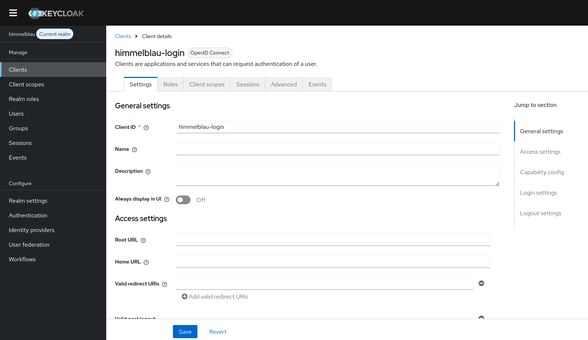

# Using Keycloak with Himmelblau

This guide shows how to configure a Keycloak OpenID Connect client for Himmelblau. Keycloak acts as the OIDC issuer, and Himmelblau uses the Keycloak client ID as its `app_id`.

The Keycloak client must allow **OAuth 2.0 Device Authorization Grant**. This is required for the classic Device Authorization Grant login flow, and it is still required when using the Himmelblau orchestrator.

## Prerequisites

Before you begin, make sure you have:

- A working Keycloak instance.
- Administrator access to the Keycloak realm that should authenticate Linux users.
- Himmelblau installed on the Linux client.
- Network connectivity from the Linux client to the Keycloak issuer URL.

The examples below use these values:

| Value | Example |
| --- | --- |
| Keycloak base URL | `https://keycloak.example.com` |
| Realm | `himmelblau` |
| Client ID | `himmelblau-login` |
| Issuer URL | `https://keycloak.example.com/realms/himmelblau` |

Replace these examples with values from your own Keycloak environment.

## Authentication Flows

Himmelblau can authenticate against Keycloak in two user-facing ways.

### Classic Device Authorization Grant

Without the orchestrator, Himmelblau uses the Device Authorization Grant directly. During login, the Linux system displays a URL and code, or a QR code. The user opens the URL in a browser, often on another device such as a phone, and completes the Keycloak login there.

This flow is useful because it does not require the Linux login screen to host a full browser interaction. The tradeoff is that first login is not completed entirely at the Linux login prompt.

### Orchestrated Login

With `orchestrator_enabled = true`, available in Himmelblau 4.x and newer, Himmelblau orchestrates the login through the native Linux PAM flow. The user enters their Keycloak credentials through the local Linux login prompt, and the sign-in is completed on the same device.

The orchestrator changes the login experience. It does not remove the requirement to enable **OAuth 2.0 Device Authorization Grant** on the Keycloak client.

## Create the Keycloak Client

Log in to the Keycloak Admin Console and select the realm that should authenticate Himmelblau users. In this guide, the realm is `himmelblau`.

In the left navigation, open **Clients**, then select **Create client**.



For **Client type**, select **OpenID Connect**. Set **Client ID** to the value that Himmelblau will use as `app_id`.

For example:

```text
himmelblau-login
```

Then click **Next**.



On the capability configuration page, enable **OAuth 2.0 Device Authorization Grant**.

Leave the other authentication flow settings at their defaults unless your environment has a specific reason to change them. The important setting for Himmelblau is that **OAuth 2.0 Device Authorization Grant** is enabled.


Click **Next**.

On the login settings page, leave the URL fields blank. Himmelblau does not need a web redirect URL for this client setup.



Click **Save**.

Keycloak opens the newly created client. Confirm that the client exists and that the client ID matches the value you plan to configure in Himmelblau.



## Configure Himmelblau

Edit `/etc/himmelblau/himmelblau.conf` on the Linux client.

For the classic Device Authorization Grant flow, use:

```ini
[global]
oidc_issuer_url = https://keycloak.example.com/realms/himmelblau
app_id = himmelblau-login
```

For Himmelblau 4.x and newer, you may optionally enable the orchestrator:

```ini
[global]
oidc_issuer_url = https://keycloak.example.com/realms/himmelblau
app_id = himmelblau-login
orchestrator_enabled = true
```

The configuration values are:

| Option | Description |
| --- | --- |
| `oidc_issuer_url` | The Keycloak realm issuer URL. For a realm named `himmelblau`, this is `https://keycloak.example.com/realms/himmelblau`. |
| `app_id` | The Keycloak client ID. This must exactly match the client ID created in Keycloak. |
| `orchestrator_enabled` | Optional. Only relevant for Himmelblau 4.x and newer. When set to `true`, Himmelblau uses the native PAM-oriented orchestrated login flow on the same device. |

The `oidc_issuer_url` must match the issuer advertised by Keycloak for the selected realm. The `app_id` must match the Keycloak client ID, not the realm name or the display name.

## Apply the Configuration

Restart the Himmelblau services after changing `/etc/himmelblau/himmelblau.conf`:

```bash
sudo systemctl restart himmelblaud himmelblaud-tasks himmelblaud-orchestrator
```

Then test authentication with a Keycloak user:

```bash
sudo aad-tool auth-test --name user@example.com
```

Replace `user@example.com` with the account identifier your Keycloak realm expects.

With the classic Device Authorization Grant flow, the test or login flow should show a URL and code, or a QR code, and the user completes authentication in a browser.

With `orchestrator_enabled = true` on Himmelblau 4.x or newer, login should use the native Linux PAM flow and complete on the same device.

## Troubleshooting

If authentication fails, check the following items first:

- Confirm that the Linux client can reach the Keycloak issuer URL over HTTPS.
- Confirm that you selected the correct Keycloak realm before creating the client.
- Confirm that `app_id` exactly matches the Keycloak client ID.
- Confirm that `oidc_issuer_url` points to the realm issuer URL, for example `https://keycloak.example.com/realms/himmelblau`.
- Confirm that **OAuth 2.0 Device Authorization Grant** is enabled on the Keycloak client.
- Do not disable Device Authorization Grant just because the orchestrator is enabled. The Keycloak client still requires it.
- If you set `orchestrator_enabled = true`, confirm that the client is running Himmelblau 4.x or newer and that the `himmelblau-orchestrator` package is installed.

Use the system journal for detailed logs:

```bash
journalctl -u himmelblaud -u himmelblaud-orchestrator
```

If you enable `debug = true` in your himmelblau.conf, the logs will include additional detail about provider discovery, token requests, and authentication flow selection.
