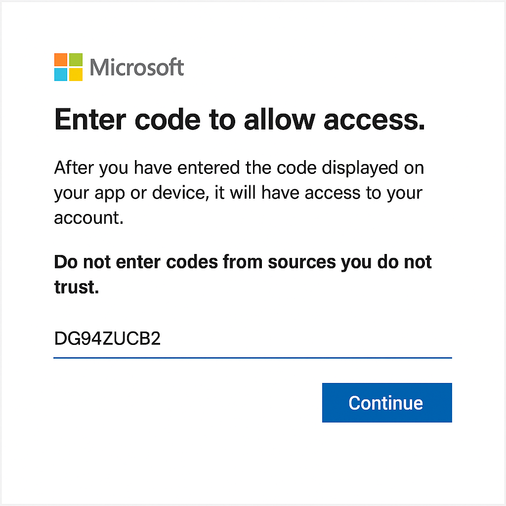
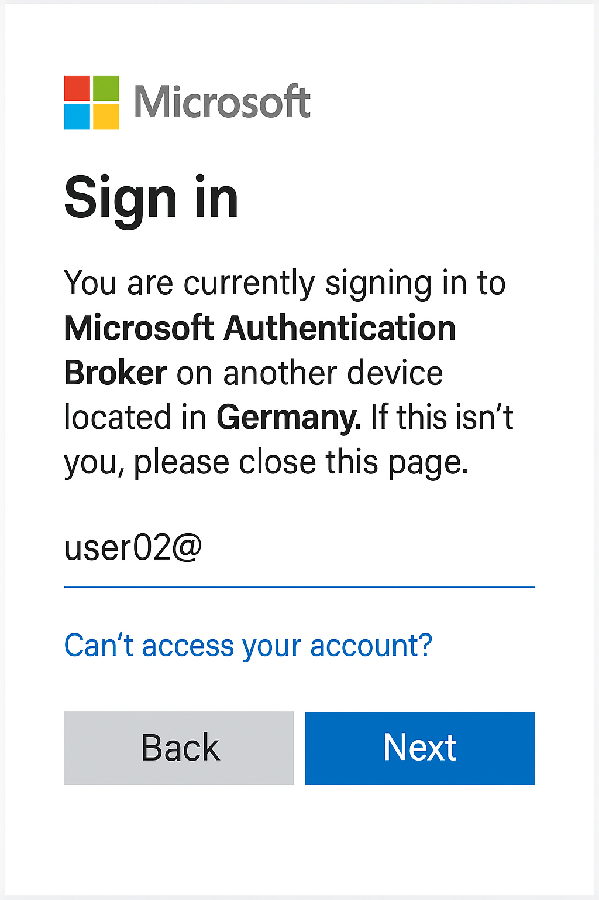
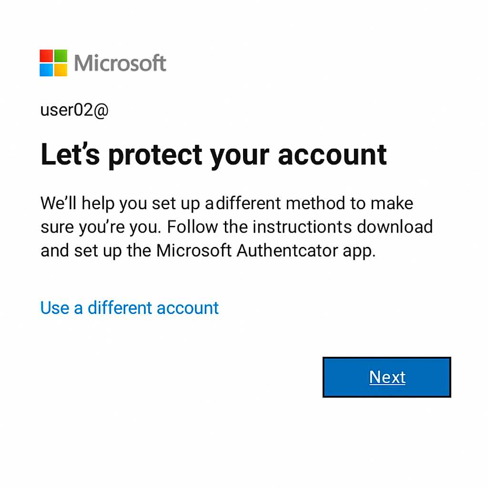
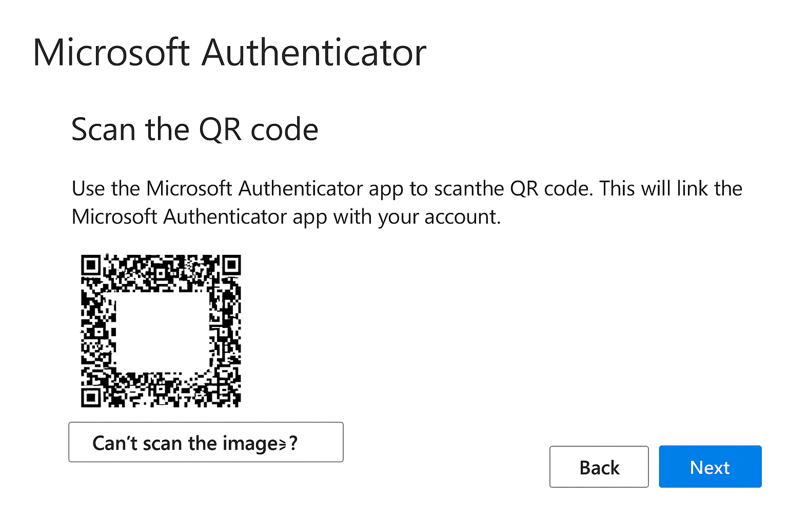
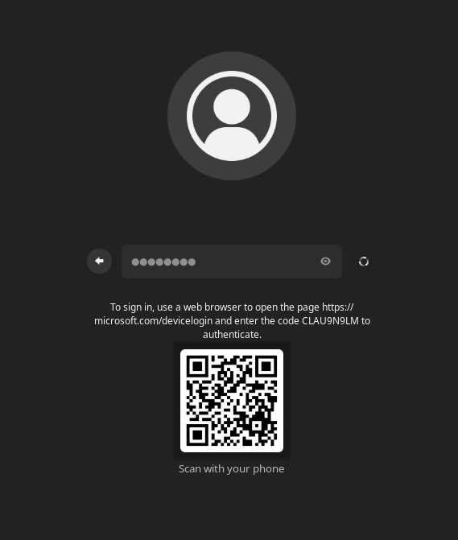

# A Practical Introduction to Himmelblau
*by [Stefan Kania](https://www.kania-online.de)*

Himmelblau is an open-source authentication framework that provides Microsoft's Azure Entra ID login for Linux systems. Its seamless and simple installation makes it easy to integrate Linux systems into Azure Entra ID and Intune.  Both the enforcement of configured policies and Hello PIN support are provided for Linux systems. Himmelblau also offers support for Office 365 single sign-on (SSO) and multi-factor authentication (MFA). Debian, Suse, and RedHat distributions are supported.

## Technical details

*Azure Entra ID* was formerly known as *Azure Active Directory* and manages all user login data in the cloud. There are no longer any local domain controllers; all login information is managed centrally in the cloud. Clients no longer need to be explicitly added to the domain; a client is added when any user logs in for the first time. However, unlike a local login to a local Active Directory, a user registration is only valid on the client on which the user has registered. If a user wants to use a different client, they must first re-register there. To do this, they always need their Entra ID password, which they generated when they first logged in. However, users can generate different PINs on each client. An administrator can also require PINs of different lengths for different clients.

Azure Entra ID is initially only a service for authentication on Windows clients. It is only through the development of Himmelblau that users with Linux clients can also authenticate with their Intra ID. This requires the authentication processes developed by Microsoft to be implemented on Linux. The extent of the problem that arises can be described here based on the very first login of a new user to a new client:

 When an administrator hands a user a laptop configured with Himmelblau and the user wants to log in from this device for the first time, this is possible. The only problem is that they have to authenticate with a DAG (Device Authorization Grant). Anyone who has ever authenticated with a video service such as Netflix is already familiar with this DAG authentication. With a DAG, the user is shown a code and a URL, and authentication with this information must then be performed from another device.

| User’s MFA status                   | Device state            | DAG needed? | Notes                                                |
| ----------------------------------- | ----------------------- | ----------- | ---------------------------------------------------- |
| MFA **already set up**              | **Unjoined** new device | **No**      | User signs in with normal MFA; join/enroll proceeds. |
| MFA **not set up** (brand new user) | **Unjoined** new device | **Yes**     | Use DAG once; then complete MFA setup after login.   |

With Himmelblau, this is a little more complicated. For the user, the process is almost transparent. With Himmelblau, it is not possible to register a real Hello key with DAG authentication (Microsoft prohibits this). Himmelblau therefore sets up a so-called "disconnected" Hello PIN. This Hello PIN is cryptographically secure, but Himmelblau cannot request new Entra ID credentials in this way, only update existing credentials (a regular Hello key registered with MFA can do both). Himmelblau's offline login and SSO strategy is slightly less effective when the user authenticates in this way. The user will probably not notice this particularly, but they may have to re-authenticate via the DAG every few weeks to maintain their SSO.

If a user changes their temporary password and sets up MFA from another client first, none of this is necessary, but it does require a client already integrated into Azure for the user's initial authentication.

One way to circumvent all this is to support a so-called Temporary Access Pass (TAP). This is a concept developed by Microsoft. A TAP is valid for a limited number of uses or for a limited period of time. These can be issued by an administrator so that a user can register with Himmelblau using a Hello PIN. With this method, the user never has Entra ID credentials except those that are exclusively linked to that specific host. From that point on, users authenticate with their device PIN. This PIN grants users MFA SSO in the browser. However, users do not have the option of using this Entra ID to authenticate on another client.

The key point here is that a user must have MFA configured before they can register their device with Entra ID. Technically speaking, this is not a mandatory requirement from Microsoft, but a restriction imposed by Himmelblau. The reason is that Microsoft sometimes requires MFA for device registration and sometimes does not. Instead of trying to accommodate both situations, Himmelblau always requires MFA. At least for device registration. For the registration of additional users, authentication with password only can then also be enabled as an option.

## Core features and benefits 

Himmelblau supports modern Azure Entra ID authentication workflows:

- OAuth2 authorization with MS-OAPX and OAPXBC extensions
- Issuance and renewal of Primary Refresh Tokens (PRT)
- Support for multi-factor authentication (MFA), including:
- Microsoft Authenticator
- FIDO2 hardware keys
- One-time passwords via SMS
- Temporary access pass
- Secure token storage and device registration
- SoftHSM and TPM backends are supported

All login data and issued tokens are stored in encrypted, machine-bound memory.

Seamless device registration with Azure Entra ID during initial login, eliminating the need to join a domain. When the first user logs in to a client, the client is automatically added to the domain.

Through integration with Siemens' linux-entra-sso, Himmelblau enables:

- Firefox, Chrome and Microsoft Edge browser SSO for Microsoft 365 and Entra ID-protected applications
- Secure, updatable token storage for long-lived sessions

Himmelblau is available for almost all major distributions. The current version 2.0 is also available for Debian 13. The following distributions are supported:

| **Distribution**      | **Version**   |
| --------------------- | ------------- |
| Debian                | 12 + 13       |
| Fedora                | 42 + 43       |
| Fedora                | Rawhide       |
| Linux Mint            | 21.3 + 22     |
| openSUSE              | 15.6          |
| openSUSE              | 16            |
| openSUSE              | Tumbleweed    |
| Oracle Linux          | 9 + 10        |
| RHEL                  | 9 + 10        |
| Rocky Linux           | 9 + 10        |
| SUSE Linux Enterprise | 15 SP6 + SP7  |
| SUSE Linux Enterprise | 16            |
| Ubuntu                | 22.04 + 24.04 |
| NixOS                 |               |

In the first part, a Linux system without a graphical user interface is set up. For the distributions listed in the table here, there are repositories available at https://himmelblau-idm.org/downloads/index.html. Himmelblau consists of a total of eight packages:

```
himmelblau_<version><distribution>
himmelblau-sshd-config_<version><distribution>
himmelblau-sso_<version><distribution>
nss-himmelblau_<version><distribution>
pam-himmelblau_<version><distribution>
himmelblau-qr-greeter_<version><distribution>
cirrus-scope_<version><distribution>
himmelblau-selinux_<version><distribution>
o365_<version><distribution>
```

The cirrus-scope package is a package for debugging authentication between Azure Entra Id and the Himmelblau Library. It is not required for normal use.

The o365 package integrates Microsoft Office desktop applications (Teams, Outlook, Word, Excel, PowerPoint, etc.) into Linux. These applications use taskbar icons to manage their background processes and quick access menus. All Microsoft o365 applications are displayed in the application menu after installing the package. 

Starting with version 2.0 for some distributions ther will be a special selinux package available.

## Installation and setup of the packages

To test the login for the first time, a Linux client without a graphical user interface is sufficient. Only the packages: 

- `himmelblau_<version><distribution>`
- `pam-himmelblau_<version><distribution>`
- `nss-himmelblau_<version><distribution`
- `himmelblau-sshd-config_<version><distribution>`

are installed for this purpose. The himmelblau-sshd-config package is only required if login via SSH on the client is to be possible.

After installing the packages, distributions based on Red Hat and SUSE require some manual work for integration into PAM. For all supported distributions based on Debian, all necessary PAM entries are made automatically. On Debian systems, the Himmelblau entries are made in the *common-** files in the /etc/pam.d/* directory. On Suse systems, it is necessary to customize the PAM system with the command *sudo pam-config --add --himmelblau*. For all other distributions, the command *aad-tool configure-pam* can be used. The *aad-tool* command is part of the Himmelblau packages. 

To also allow users to access via SSH using the PIN, it is necessary to adjust the line from Listing 1 in the file /etc/pam.d/common-auth:

```
--------- Listing 1-------
auth    [success=2 default=ignore]    pam_himmelblau.so ignore_unknown_user mfa_poll_prompt
----------------------------
```

Without this adjustment, the password will always be requested instead of the PIN. The option *mfa_poll_prompt* is only needed if a distribution is usesd with an unfixed patch of OpenSSH. In Ubuntu and openSUSE OpenSSH isd already patched.

To access a Linux client via SSH, you also need to adjust the SSH configuration. To do this, create the file */etc/ssh/sshd_config.d/himmelblau.conf* with the content from Listing 2:

```
----- Listing 2 -----------
KbdInteractiveAuthentication yes
---------------------------- 
```

Then restart the SSH service.

To enable the Linux system to access the user database, the file etnsswitch.conf* must now be adjusted. Listing 2 shows the adjustments:

```
------- Listing 3 -------
passwd: 	files systemd himmelblau
group:		files systemd himmelblau 
shadow: 	files systemd himmelblau
-------------------------
```

If the packages from the original URL are used, these entries are also generated automatically.

The only thing missing is the domain at which users should log in on the client. To do this, the configuration of Himmelblau is adjusted in the file /etc/himmelblau/himmelblau.conf. Listing 4 shows the change in the file:

```
------- Listing 4 --------
domain=example.onmicrosoft.com
---------------------------
```

Only the name of your own domain is required. All other settings can be adopted for the time being. 

Anyone who has already gained experience with Entra ID and Microsoft clients will be surprised by this entry, because with a Windows client, the name of the domain is determined from the user's UPN when they log in, which does not yet work with Himmelblau.

After configuring Himmelblau, it is still necessary to start the two services *himmelblaud* and *himmelblaud-tasks* and activate them permanently. Only then can the first login be performed. Listing 5 shows how to start the services:

```
----------- Listing 5 ---------
 systemctl enable --now himmelblaud himmelblaud-tasks
--------------------------------
```

## The first login of a new user

After the user has been created in the Azure portal and assigned an initial password, the user can log in with the new account and the initial password. Listing 6 shows the first login of a new user on a Linux client integrated into the domain

```
-------Listing 6 ----
ssh user02@192.168.56.81                                                                                                                                                                                                       
(user02@192.168.56.81) Use the password for your Office 365 or Microsoft online login. 
Entra Id Password: <initial password>
(user02@192.168.56.81) To sign in, use a web browser to open the page https/microsoft.codevicelogin and enter the code DG94ZUCB2 to authenticate. 
Press enter to continue
------------
```

The new user must always log in via a browser using the URL listed in Listing 6 the first time. This is because two-factor authentication and a password change are still required. Registration is only performed once; if the user wants to log in to another system later, these steps are no longer necessary.

When logging in via the browser, the code generated in the command line is required.



Only after entering the code does the actual login take place.

The user logs in with their full name, in this case [user02@example.onmicrosoft.com](mailto:user02@0pndv.onmicrosoft.com).



The initial password is required again here and must be changed in the next step.


This is followed by a note on setting up two-factor authentication. Here you can use any app, such as Google Authenticator or Microsoft Authenticator. Microsoft Authenticator has the advantage that the user can later log in directly in the app with a two-digit number. However, the user can also change which app is used later.



This is followed by instructions on how to use the app and a link to install it. Once the user has installed the app on their smartphone, they can continue with the setup. In this example, Microsoft Authenticator is used, which is why the setup instructions are provided here.


After another window with additional instructions, a window with a QR code appears, which is scanned using the app. Only when the account has been entered correctly in the app can the user click on CONTINUE.



The following test checks whether the setup was successful. To perform the test, the user must enter the two-digit number in their app. Only if the number is correct will the next screen appear with confirmation of the setup.


Please note: This test is only performed if Microsoft Authenticator is used; Google Authenticator cannot perform this two-factor verification with a two-digit number. 


Finally, the successful first login is summarized and displayed again.


If the app needs to be changed later, the user can do this themselves via the URL https://mysignins.microsoft.com/security-info.

After completing the setup, the first login (here via ssh) to the Linux client follows. However, it is also possible to log in directly to a client integrated in Azure. Even when logging in locally on the client, it is sufficient to specify the CN (the CN is the part before the @ in the UPN); it is not necessary to specify the full name (User Principle Name (UPN)). The name is resolved via NSS, because himmelblau is entered there as the authentication source.

Note: To make user logins unique, care should be taken to ensure that there are no local users with the same name in the domain.  Listing 7 shows the first login attempt after setting up two-factor authentication:

```
--------------Listing 7 ---------------
ssh user02@192.168.56.81                                                                                                                                                                                       
(user02@192.168.56.81) Use the password for your Office 365 or Microsoft online login. 
Entra Id Password:  
(user02@192.168.56.81) Open your Authenticator app, and enter the number '11' to sign in. 
No push? Check your mobile device's internet connection. 
Press enter to continue 
(user02@192.168.56.81) Set up a PIN 
A Hello PIN is a fast, secure way to sign in to your device, apps, and services. 
The minimum PIN length is 6 characters. 
New PIN:  
(user02@192.168.56.81) Set up a PIN 
A Hello PIN is a fast, secure way to sign in to your device, apps, and services. 
The minimum PIN length is 6 characters. 
Confirm PIN:  
Enrolling the Hello PIN. Please wait... 
Enrolling the Hello PIN. Please wait...  
...
user02@himmelblau:~$ 
-----------------------------
```

When you log in to the console for the first time, you will be asked to enter your new password again. If the password is correct, a two-digit number (11 in the example) will be displayed here, which you then enter in the app. Only when this number has been verified by the app will the system generate a new Hello PIN, which will then be used later to log in instead of the password. When logging in for the first time, a $HOME directory is always created for the user.

This part of the login must be performed by the user on every new Linux client on which the user logs in for the first time. However, the user can use the same PIN for each client. The system does not check whether the PIN is already being used on another client. This would not be possible anyway, as the information is encrypted on the client.

For each subsequent login, only the PIN is now required, regardless of whether it is a local login or a login via ssh. Listing 8 shows another login using the PIN:

```
-------------Listing 8 --------------
ssh user02@192.168.56.81                                                                                                                                                                                            
(user02@192.168.56.81) Use the Linux Hello PIN for this device. 
PIN:   
...
user02@himmelblau:~$ 
--------------------------- 
```

## The Linux client

What happens on the Linux client when it is integrated into Azure? During setup, Himmelblau was entered into theetnssswitch.conf file. Now the domain specified in the configuration is searched for users and groups. The identity of the user can also be queried with the command *id* or *getent passwd <username>*. Listing 10 shows the information for the user just set up:

```
------------ Listing 10 -----------
user02@himmelblau:~$ id 
uid=773235643(user02) gid=773235643(user02) groups=773235643(user02),100(users),145696387(datengruppe),154317179(MSFT)

user02@himmelblau:~$ getent passwd user02 
user02:x:773235643:773235643:user02homuser02bibash
-----------------------------------
```

But what about the groups in the Azure domain? A simple *getent group <groupname>* does not return any results. For security reasons, the query via the group name has been disabled. Another reason is that there is no UPN for groups, so there may be groups with the same name in different domains. This could lead to the group not being unique. The query only works via the GID, or *Entra Id Object Id* of the group. Listing 11 shows the difference:

```
----- Listing 11 ------
root@himmelblau:~# getent group datengruppe 
root@himmelblau:~# 

root@himmelblau:~# getent group 145696387 
datengruppe:x:145696387:user02,user01

root@himmelblau:~# getent group bb845f7f-8f6a-4101-b4c7-8db3cb94c9e6
datengruppe:x:1496389:user01,stka
-----------------------
```

Since logging in to an Azure domain is no different from logging in to a local Active Directory (in terms of ID mapping), the UIDs and GIDs are always identical on all systems. 

## Local parameters

Local parameters can also be defined in the configuration file. These are settings that affect behavior on the client. For example, you can specify which local group a user from the domains is a member of.

The local parameters that affect settings on the local client are located in the [global] section of the configuration; unfortunately, there is no separate section for adjustments that affect settings on the local client.

To enter users locally in groups on a client, the *local_groups* variable is extended. The individual local groups are entered separated by commas. If a group is later removed at this point, the users must be manually removed from the group. To do this, edit the etgroups* file. 

When a user logs in for the first time, a home directory is automatically created. The default directory for this is home*. If you want the directory to be created in a different location in the file system,  you can specify this using the variable  *home_prefix =*.

It is also possible to copy certain data from a directory to the user's new home directory. This process is identical to creating a local user via the etskel* directory. To transfer data, the variable *use_etc_skel = true* can be set, then all files and directories from etskel* will be transferred. 

Since no shell is specified in the user's profile in the Azure domain, a default shell can be assigned to all users using the variable *shell =bibash*.

Note: The attributes from Listing 12 should always be set on Debian and Ubuntu systems. These values are also always entered in the configuration when installing the packages:

```
----- Listing 12 -----
home_attr = CN
home_alias = CN
use_etc_skel = true
------------------------ 
```

## Global parameters

Some settings can only be defined globally, i.e. for all registered domains. The [global] section is always at the beginning of the configuration. The settings also include customizing the login on the client.

## Customizing login security

The configuration file can also be used to set parameters that improve login security. It is important to note that these adjustments must always be made in the [global] section, as these parameters always apply to all domains set up on the client. All changes to the configuration require a restart of both Himmelblau services.

For example, it is possible to disable PIN-based logins and always require MFA. To do this, the configuration is adjusted as shown in Listing 13.

```
-------- Listing 13 ------
## Disable PIN login and always use MFA 
enable_hello=false
----------------------------
```

After restarting the *himmelblaud* and *himmelblaud-tasks* services, the Entra ID password is always requested when logging in to this client and a two-digit number is generated, which must then be entered in the app. Login with the PIN is then no longer possible.

However, even when using the PIN, some additional security options can be configured. All PIN-related adjustments can only be entered in the [global] area on a client. The settings are always identical for all domains. Listing 14 shows the options:

```
----- Listing 14 ----
## Minimum length of the PIN 
hello_pin_min_length = 8 

## Number of invalid retries 
hello_pin_retry_count = 4 

## Customize the PIN prompt 
hello_pin_prompt = Please enter your PIN for login 

## Customize Entra Id password prompt 
entra_id_password_prompt = Please enter your Entra Id password
-----------------------

```

It is also possible to allow only certain users or groups to log in to a client. To do this, insert the line from Listing 15 into the configuration:

```
----- Listing 15 -----
## Only the following users and groups are allowed on this client 
pam_allow_groups = user01@example.onmicrosoft.com,bb845f7f-8f6a-4101-b4c7-8db3cb94c9e6
------------------------
```

Users and groups are entered here separated by commas. For users, the UPN must be used. For groups, the Object ID GUID must be used. The reason for this is that when using group names and connecting to multiple domains, the uniqueness of the groups cannot be guaranteed.

If a user who has an Entra ID but is not explicitly entered or is not a member of an entered group attempts to log in, the login is canceled. Listing 16 shows the corresponding output:

```
----- Listing 16 -----
ssh user02@192.168.56.81                                                                                                                                                                                              
(user02@192.168.56.81) Use the Linux Hello PIN for this device. 
PIN:  
Connection closed by 192.168.56.81 port 22
------------------------
```

If debugging is enabled in the configuration (debug = true), the following lines from Listing 17 are displayed 

```
----- Listing 17 ------
[debug]: Checking if user is in allowed groups ({"bb845f7f-8f6a-4101-b4c7-8db3cb94c9e6", "user01@example.onmicrosoft.com"}) -> {"28174bcd-25b9-4f82-9965-671b2750f090", "8

[debug]: Number of intersecting groups: 0
-------------------------
```

If user01 were to log on to the system, the value would be *Number of intersecting groups: 2.* Why *2*? The user is both directly in the list of allowed users and a member of the group entered in the list. 

This allows a group to be created for specific clients with the users who are allowed to log in to that client.

## Domain parameters

In addition to the local and global parameters, it is also possible to configure specific settings for individual domains. The settings for a domain always begin with the name of the domain in square brackets.

## Adjusting the idmap range

No individual ID mapping has been performed up to this point. If no individual ID mapping is configured, the range from 200000 to 2000200000 is always used as default. Since multiple domains separated by commas can be specified in the configuration file for the *domains* variable, it is necessary to define a separate range for each domain at this point at the latest. To do this, the fileethimmelblahimmelblau.conf is adjusted as shown in Listing 18:

```
------ Listing 18 ------
[example.onmicrosoft.com] 
idmap_range = 1000000-1999999
--------------------------
```

It is important to enter the adjustment at the end of the file, otherwise the parameters of the [global] section below the entry will no longer be evaluated.  Even if the lines are commented out, they must not be located in the middle of the [global] section. After changing the idmap range and restarting the two Himmelblau services, the users and groups can be displayed with a new ID. 

It is important to make the change on all clients, otherwise the same user (and also the groups) will have different IDs.  

In addition to adjusting the *idmap_range*, it is possible to set additional parameters. Here, it is also possible to override certain local settings. For example, if a different target directory for the home directories is to be created for each domain, the additional variable *home_prefix=/domainname/* ensures that the home directory for all users of this domain is created in a corresponding directory. The variable entry must be placed below the domain name in square brackets. 

Further variables that can be set up specifically for domains are described in the man page for the *himmelblau.conf* file.

## Resetting a client

All information about all users set up on this client is stored in an SQLite database in the file */var/cache/himmelblaud/himmelblau.cache.db.* If a client is to be permanently removed from the domain, or if all users are to re-register their accounts on the client, the file can be deleted. This will invalidate all information about all users on this client. Before deleting, the two Himmelblau services should be stopped in any case. Once the file has been deleted and the services have been restarted, the database will be rebuilt.

The database can be reset and the client removed from the domain using the *aad-tool* command. Listing 19 shows the process:

```
------ Listing 19 -----
root@skyblue:skyblue# aad-tool cache-clear --full 
This will unjoin the host, clear all caches, and cannot be undone. Proceed? [N]: y 
success
-------------------------
```

## Clients with GUI

Of course, not every user will work exclusively with a console or access via SSH; most users will log in to a Linux client with a GUI. There is a solution for this as well. 

This section shows how to set up a client with a GUI, together with SSO via Firefox.

In the first step, the following two packages must also be installed:

- himmelblau-sso_<version><distribution>
- himmelblau-qr-greeter_<version><distribution> 	

After installing all packages and setting up the configuration, a user can log in to the system with their Azure ID. The login process involves the same steps as described for the first login to the system without a GUI.

If you also want to enable the very first login of a completely new user, you will need to set up qr-greeter. This requires the machinectl program. The program is part of the Debian package systemd-container and must be installed first. After installation, you will need to perform all the steps listed in Listing 20:

```
-------- Listing 20 --------
root@skyblue-gui:~# machinectl shell Debian-gdm@bibash 
Connected to the local host. Press ^] three times within 1s to exit session. 

Debian-gdm@himmelblau-gui:~$ gsettings set org.gnome.shell enabled-extensions "['qr-greeter@himmelblau-idm.org']"

Debian-gdm@himmelblau-gui:~$ exit 

Debian-gdm@himmelblau-gui:~$systemctl restart gdm3
------------------------------
```

IMPORTANT: Under no circumstances should you use your own domain here, only the domain himmelblau-idm.org, otherwise no QR code will be generated when a new user logs in for the first time. If everything has been set up correctly, the following image will appear when a user logs in for the very first time after entering their username and initial password:



The user can then scan the QR code with their smartphone and will be taken to the website where they can complete the initial login.


This only works if *gdm* is used as the login manager and a Gnome version >=45 is used.

After successful login, the sso can be tested immediately. Installing the *himmelblau-sso* package also installs and activates the required plugin for Firefox.


This allows an immediate connection to the Azure cloud and the booked applications. No further login is necessary. 

This completes the integration of a Linux client with GUI. The configuration for a client with GUI can be copied 1:1 from another client, even without GUI. It is only important that the *idmap range* is always identical.
