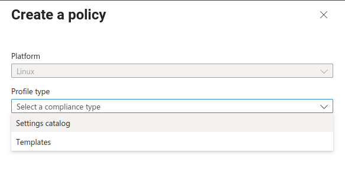
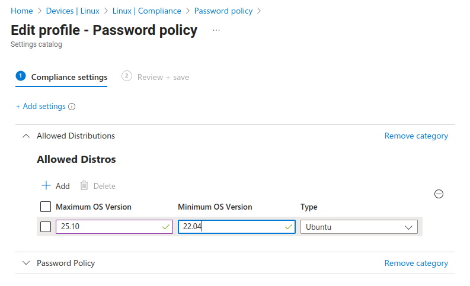
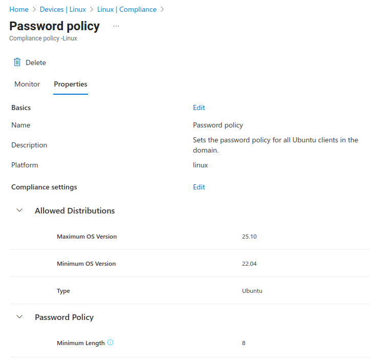
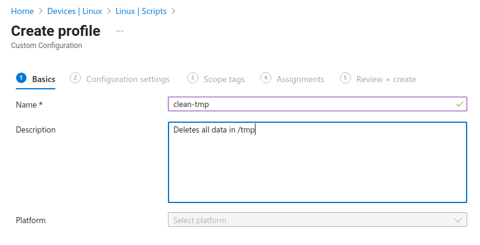

# Intune Policies for Linux Clients
*by [Stefan Kania](https://www.kania-online.de)*

This part deals with the use of Intune to create policies when deploying
Linux clients in an Entra Id environment.

## What is Intune?

Intune is comparable to Group Policy Objects (GPOs) in Active Directory.
Many GPOs from an existing Active Directory can be exported to Intune.
GPOs for Linux clients can also be set up in Intune. However, it is not
possible to import Linux GPOs (e.g., from a Samba AD). This is not due
to Himmelblau, but rather to Microsoft's restrictions. Linux clients are
supported, but not very extensively.

There is another major limitation when setting up policies for Linux
clients. Regardless of the type of policies set up for a Linux client,
logging in to a Linux client is then only possible with one user, namely
the user who integrated the machine into Entra Id. This limitation does
not come from Himmelblau, but is also a Microsoft requirement. This
means that the use of policies on Linux clients only makes sense for
machines that are used by a single user.

The policies can be managed via the URL https://intune.microsoft.com/.
If you have already logged in to the Entra Id portal, the same user will
be automatically logged in here.

First, let's take a look at device management in Entra Id. Without
further restrictions, any user who has an account in the Entra Id domain
can add a machine to the domain.

If a Linux client is to be managed in Intune at a later date, it is
essential that the user who adds the client to the domain has the
appropriate license. Licenses can be managed at
<https://admin.cloud.microsoft/>. The following figure shows an excerpt
from the list of all users, with and without licenses.

Only when the user adds a client to the domain will the client be
recognized as a Linux client in both Entra Id and Intune.

In Intune, all devices that can be managed are displayed in the device
overview, sorted by operating system. Linux clients added to the domain
by a user without a license are not listed here. Only the device
overview of the Entra Id portal displays all devices.

Now policies can be set up and assigned.

First, a policy for passwords should be created and assigned. To avoid
having to add each client individually to the policy, a group can be
created either in the Entra Id portal or directly in Intune, in which
all desired systems are entered as members. In the Intune Admin Center,
select the menu item Devices→Linux → Compliance.

Currently, no policies are listed there. You can then create an initial
policy via the **Create Policy** link.

After clicking on the link, the following selection is displayed on the
right-hand side.

Now select the Settings Catalog option and confirm at the bottom.

In the next window, enter the name for the policy. The description is
optional, but always useful and helpful.

After saving the empty policy, a new page is displayed. Clicking on the
**Add Settings** link then allows you to
define the actual settings for the policy.

A selection of policies that can be used for Linux clients now appears
on the right-hand side. Clicking on Password Policies then displays all
the setting options below.

Clicking on one of the options opens a display on the left side where
the settings can be made.

Once all the desired settings have been made, the policy can be saved.
You then have the option of sending an email to owners of incompatible
devices. This option makes sense if the policy is only intended for
Linux clients for a specific distribution. The password policy created
here should now only apply to Ubuntu clients. For this reason, the
policy will be expanded later.

The policy can now be assigned to a group. The assignment is made in the
**Assignments** section of the policy
creation. The **Scope Tags** item remains
unchanged.

In the Assignments section, the previously created group with the
corresponding Linux clients is now added.

After clicking **Next**, a summary is
displayed. Only now is the policy entered into the system by clicking
**Create**.

To ensure that the policy is only effective for Ubuntu clients, the
policy is now extended. To do this, the properties of the policy are
called up and an existing policy can be changed there via the link
**Compliance Settings** →
**Edit**.

Now a new setting is to be added, namely a setting of the type
**Allowed Distributions**

After making your selection, you can configure the settings for the
distribution on the left-hand side.

Unfortunately, only Ubuntu and Redhat are currently available for
selection. Other distributions are not (yet) supported.

Redhat only supports versions 8 and 9, and Ubuntu only supports desktop
versions 22.04 and 24.04.

However, the restriction on Ubuntu versions only applies to the use of
the Microsoft client for Linux systems.

Himmelblau can also recognize newer versions and display them as
compatible. The use of Ubuntu Server is also not a problem.

Now the settings can be checked again and then saved. Afterwards, a
summary of all settings can be displayed again. To do this, go to the
menu item Devices → Linux → Manage Devices → Compliance. All policies
are displayed at this point. After clicking on the new policy, the
properties can be displayed as shown in the following figure.

Another option for managing Linux clients is to assign scripts. The
corresponding setting can be found under Devices → Linux → Manage
Devices → Scripts

A new script is now added here. The first step is to enter a name and
description for the script.

In the next step, the configuration of the script can be adjusted. There
are two ways to provide the script: Either the script can be uploaded
from the local system, in which case it is important to ensure that the
file extension is .sh; other extensions are not permitted and will
result in an error message. The other option is to create the script
directly in the "Bash script" field. When a script is uploaded, its
content also appears in this area and can be customized here. Another
important setting here is the execution time of the script. The
following image shows the creation of a script.

As with the first policy, the next step is to assign the script to the
desired groups and users.

To check whether a script has been executed without errors, go to
Devices → Linux → Scripts. There you can check the status of the
scripts. The following image shows the successful execution of the
script.

Unfortunately, there is currently no way to check which policies are applied on the
Linux client, as is the case with Linux GPOs in Samba Active Directory,
for example. At the moment, the only option is to test the settings on
the client.

In addition to the policy options described here, the following policies
can also be set up for Linux clients.

## Checking the encryption of local disks

Especially with notebooks, it may be necessary to ensure that the file
system is encrypted. A new policy can be used to check this for specific
devices.

The first step is to create a new group that includes all Linux devices
for which file system encryption needs to be checked.

Now, a new policy can be created in Intune under Devices→ Linux → Manage
devices → Compliance. As in the example for passwords, a policy is
selected from the settings catalog. After assigning a name for the
policy and a descriptive description, a new policy type can be added by
clicking on Add setting.

On the left side, the setting Require device encryption is then set to TRUE. The following two items (Actions in case of incompatibility and
Scope tags) can be set according to your own specifications, but are not
relevant for device verification.

The new policy is then assigned to the group created at the beginning.

After clicking Continue, the summary of the new policy appears again.
You can then complete the creation of the policy. The new policy will
then appear in the list of previously created policies.

## Removing devices that have not been logged in for a preset period of time

This policy can be used to ensure that devices that have been inactive
for a long time are removed from Entra Id management. The device must
then be re-added the next time it logs in.

## Use of custom scripts for compliance testing

Custom policies for compliance testing are not currently possible.
