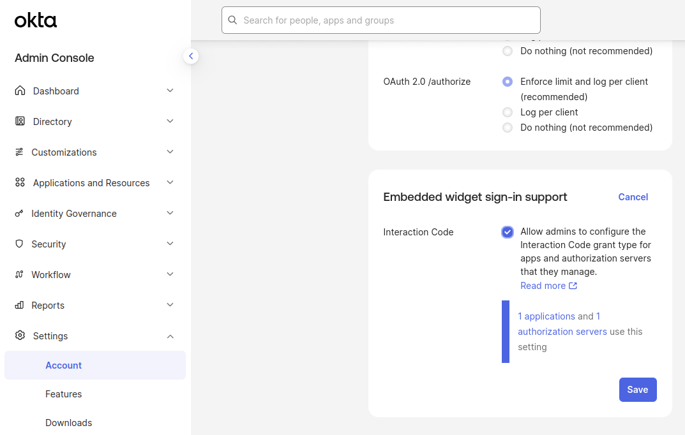
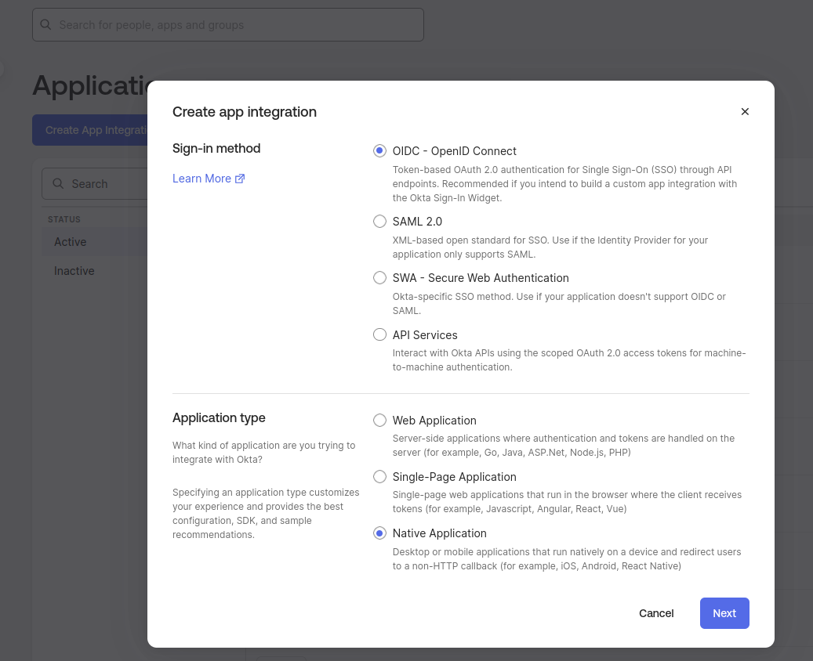
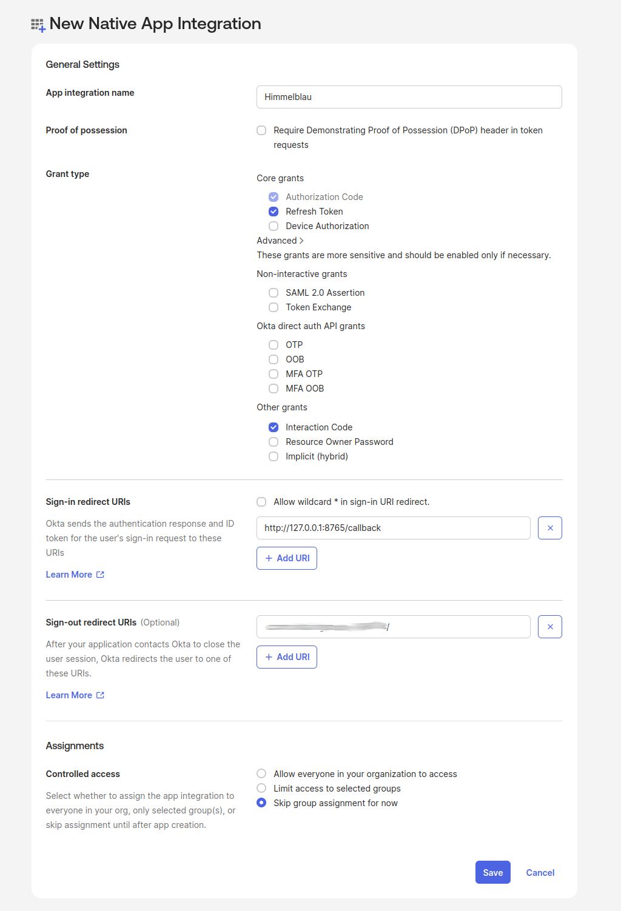
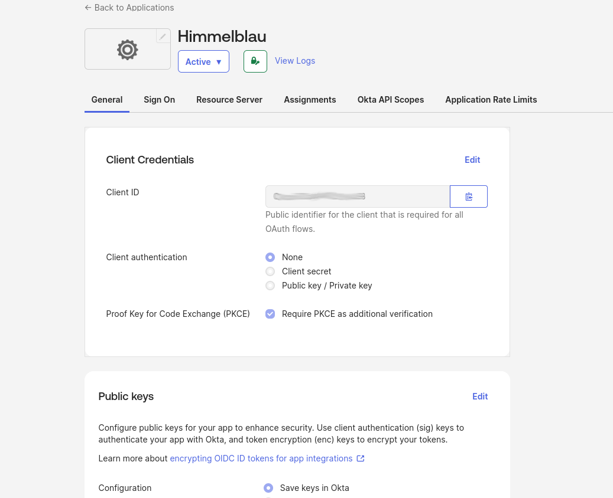
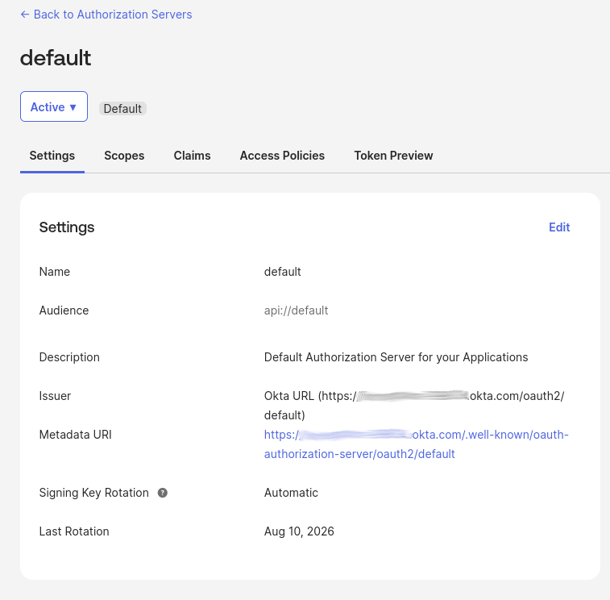
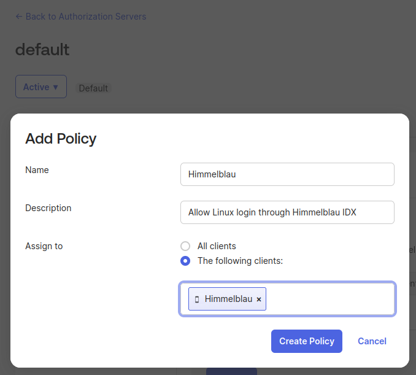
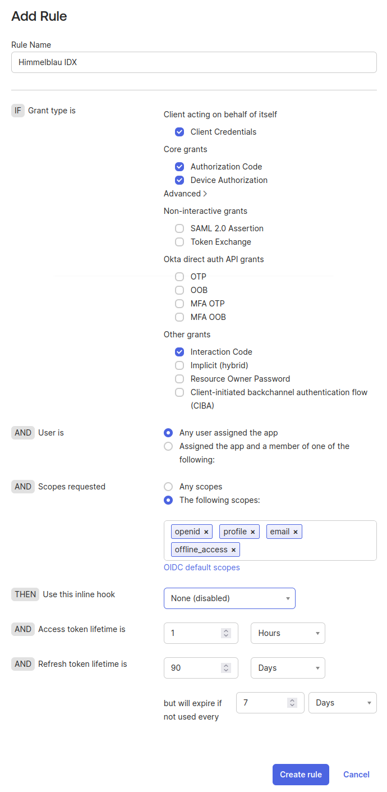
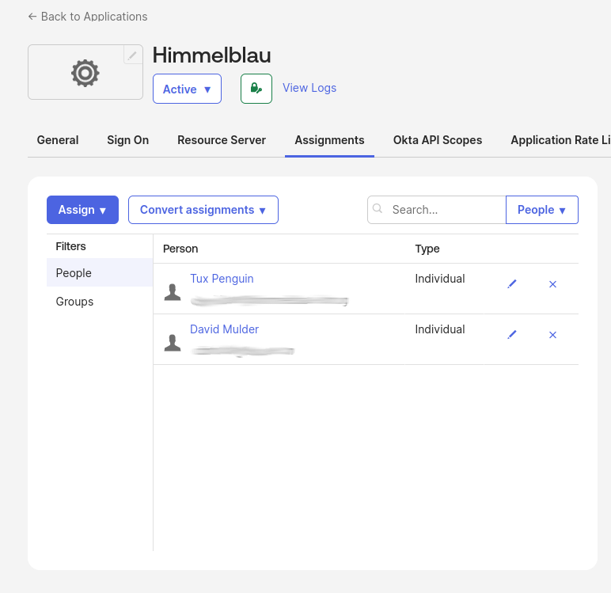
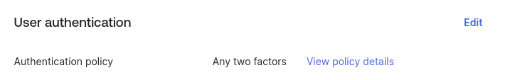

# Using Himmelblau with Okta

This guide walks IT administrators through configuring an Okta application and a Linux host for native Okta IDX login. Users complete supported credential and MFA prompts through the Linux login interface. Okta calls the grant used by this flow **Interaction Code**.

!!! note "Experimental"
    Native Okta IDX login is available only in nightly builds containing this feature until Himmelblau 5.0 is released.

## Prerequisites

- An **Okta Identity Engine** organization.
- Permission to manage applications and authorization server policies. Enabling Interaction Code for the organization requires **Super Admin** permission.
- Access to the **default custom authorization server**. Okta includes this in Integrator Free Plan organizations; custom authorization servers require **API Access Management** in production. See [Okta's authorization server guidance](https://developer.okta.com/docs/concepts/auth-servers/).
- A test user with existing MFA enrollment and an authentication policy that permits a supported native method, such as an Okta Verify push or verification code.
- A Linux host with Himmelblau installed, PAM and NSS configured, and HTTPS connectivity to Okta. See [Installation](../installation.md) and [Configuration](../configuration.md).

On the [Downloads page](https://himmelblau-idm.org/downloads), expand **Advanced manual package repository instructions**, select **Community Nightly**, and follow the instructions for your distribution.

The examples use these values. Replace the organization domain and client ID with your own:

| Value | Example |
| --- | --- |
| Application name | `Himmelblau` |
| Authorization server | `default` |
| Issuer URL | `https://your-org.okta.com/oauth2/default` |
| Client ID | `YOUR_OKTA_CLIENT_ID` |
| Sign-in redirect URI | `http://127.0.0.1:8765/callback` |

## Enable Interaction Code for the Organization

In the Okta Admin Console:

1. Open **Settings → Account**.
2. Find **Embedded widget sign-in support** and select **Edit**.
3. Select **Interaction Code** and save. If it is already selected, leave it enabled.



*Enable Interaction Code for the organization before configuring the application and authorization server.*

This organization setting makes Interaction Code available in application settings and authorization server rules. Despite the panel's name, it also applies to Himmelblau's native client. See [Configure embedded sign-in support](https://help.okta.com/oie/en-us/content/topics/settings/embedded-sign-in-support.htm).

## Create the Okta Application

1. Open **Applications and Resources → Applications**. Some consoles label this **Applications → Applications**.
2. Select **Create App Integration**. If offered a choice of creation experiences, choose **Classic experience** to access the integration wizard.
3. Select **OIDC – OpenID Connect** as the sign-in method and **Native Application** as the application type, then select **Next**.



*Create a native OIDC application for Himmelblau.*

Configure the application:

| Setting | Value |
| --- | --- |
| App integration name | `Himmelblau` |
| Grant types | Retain **Authorization Code**, enable **Refresh Token**, and enable **Interaction Code** under **Advanced** |
| Sign-in redirect URIs | `http://127.0.0.1:8765/callback` |
| Controlled access | Select **Skip group assignment for now**; assign the intended users or groups below |

If **Interaction Code** is missing, check the organization setting from the previous section. Save the application.



*Enable the application grants and register the exact callback URI used by Himmelblau.*

On the application's **General** tab, copy the **Client ID** from **Client Credentials**. This is the value for Himmelblau's `app_id`; it is not the application display name. Confirm that **Client authentication** is **None** and **Require PKCE as additional validation** is selected. Himmelblau uses PKCE and does not use a client secret.



*Copy your application's Client ID for `app_id`; keep public-client authentication with PKCE.*

For an existing native application, edit its **General Settings** to enable the grants above and register the same redirect URI. Okta documents both creation and updates in its [Interaction Code setup guide](https://developer.okta.com/docs/guides/implement-grant-type/interactioncode/main/).

## Configure the Authorization Server

### Confirm the Issuer

Open **Security → API → Authorization Servers** and select **default**. On the **Settings** tab, confirm its issuer URL:

```text
https://your-org.okta.com/oauth2/default
```



*Use the Issuer value, including `/oauth2/default`.*

Copy the complete issuer, including `/oauth2/default`. This is the value for Himmelblau's `oidc_issuer_url`.

### Allow the Application and Grant

1. Open the server's **Access Policies** tab.
2. Select a policy whose **Assign to** setting includes the Himmelblau application. If none exists, select **Add Policy**, name it `Himmelblau`, provide a description, and assign it to the Himmelblau client using **The following clients**. Create the policy.

    

    *Assign the access policy to the Himmelblau application.*

3. Edit the matching rule, or select **Add Rule** and name the new rule `Himmelblau IDX`.
4. Under **IF Grant type is**, retain **Authorization Code**, expand **Advanced**, and select **Interaction Code** in **Other grants**.
5. Under **AND User is**, select **Any user assigned the app**, or restrict the condition to the intended assigned groups.
6. Ensure the scope condition allows all scopes requested by Himmelblau: `openid`, `profile`, `email`, and `offline_access`. If the rule uses **The following scopes**, include all four; an existing **Any scopes** condition also covers them.
7. Use your organization's token lifetime settings and save with **Create Rule** or **Update Rule**.



*Allow Interaction Code for assigned users and the four requested scopes. The additional Client Credentials and Device Authorization selections shown are not required for native IDX login. Token lifetimes shown are examples; use your organization's settings.*

Check policy and rule order: Okta evaluates them in priority order, and an earlier match may determine the result. A policy without a matching rule does not authorize the request. See [Create access policies](https://help.okta.com/oie/en-us/content/topics/security/api-config-access-policies.htm).

This access policy controls token issuance. The application's authentication policy separately controls the credentials and MFA required during login.

## Assign Users and Check the MFA Policy

Return to **Applications and Resources → Applications → Himmelblau**:

1. Open **Assignments → Assign**.
2. Choose **Assign to People** or **Assign to Groups**.
3. Assign the intended test users or group and select **Done**.



*Confirm that the intended users or groups are assigned to the application.*

See [Assign app integrations](https://help.okta.com/oie/en-us/content/topics/apps/apps-assign-applications.htm) for details.

On the **Sign On** tab, locate **User authentication** and check the assigned authentication policy. Use your existing MFA policy and confirm that the test user is enrolled in a method it permits.



*This example uses the Any two factors policy. Follow **View policy details** to check your application's existing policy.*

Native login can present supported prompts such as verification-code entry or approval of an Okta Verify push. A policy requiring an external browser redirect or an unsupported step must offer a supported native alternative. Configuring new authenticators is outside this guide.

## Configure Himmelblau

Edit `/etc/himmelblau/himmelblau.conf`. Add or update these settings in the existing `[global]` section, preserving any other host-specific settings:

```ini
[global]
oidc_issuer_url = https://your-org.okta.com/oauth2/default
app_id = YOUR_OKTA_CLIENT_ID
oidc_force_interaction_code = true
oidc_redirect_uri = http://127.0.0.1:8765/callback
```

| Option | Meaning |
| --- | --- |
| `oidc_issuer_url` | The complete issuer URL from the selected authorization server. |
| `app_id` | The Client ID from the native application's General tab. |
| `oidc_force_interaction_code` | Require native IDX login and prevent fallback to device authorization or the browser orchestrator. |
| `oidc_redirect_uri` | The exact sign-in redirect URI registered on the application. |

With `oidc_force_interaction_code = false` (the default), Himmelblau probes compatible providers and can select the standard OIDC flow when native authentication is unavailable and fallback is supported. This guide sets it to `true` so a configuration problem cannot silently select another flow. Backend selection lasts until the daemon restarts; temporary network outages defer selection.

Native IDX login does not require the Himmelblau orchestrator or `orchestrator_enabled = true`.

## Apply the Configuration and Test Login

Restart the services after changing the configuration:

```bash
sudo systemctl restart himmelblaud himmelblaud-tasks
```

Test with the assigned user's account identifier:

```bash
sudo aad-tool auth-test --name user@example.com
```

Replace `user@example.com` with the account identifier for your Okta user. Complete the credential and MFA prompts required by the policy. For example, enter the requested verification code or approve an Okta Verify push. The exact prompts depend on the user's enrolled authenticators and policy.

After the authentication test succeeds, test a Linux console or graphical login with the same user to verify PAM, NSS, and session integration. An authentication test alone does not verify the full desktop login.

### Optional Local Hello PIN

When `enable_hello = true` (the default), a successful sign-in can lead to local Hello PIN enrollment. This is a Himmelblau credential on the Linux host. Keep **Refresh Token** enabled and allow `offline_access` so Himmelblau can obtain the refresh token needed for Hello. Follow any additional local enrollment prompts presented by the host's configuration.

## Troubleshooting

| Symptom | What to check |
| --- | --- |
| Interaction Code is missing in the portal | Enable it under **Settings → Account → Embedded widget sign-in support** with Super Admin permissions. |
| Client is not authorized for the grant | Check Interaction Code at all three levels: organization, application, and matching authorization server rule. Re-enabling the organization setting does not automatically restore grants previously disabled on apps and servers. |
| No matching policy or access denied | Check application assignment, access-policy client assignment, rule users and scopes, rule priority, and the application's MFA policy. |
| Discovery fails or issuer mismatch is reported | Use the issuer shown for the selected server, including `/oauth2/default`, and check HTTPS connectivity. |
| Invalid client or redirect URI | Copy the Client ID from the native application. Verify public-client authentication and the exact `http://127.0.0.1:8765/callback` registration. |
| A device-code or browser login appears | Confirm that the installed nightly contains IDX support and `oidc_force_interaction_code = true` is in `[global]`. Restart the daemon. |
| External or unsupported authentication step | Use a supported native method permitted by the policy. The registered redirect URI does not provide a browser callback service. |
| Hello enrollment cannot complete | Check that refresh tokens and `offline_access` are permitted for this application and user. |

Read daemon logs with:

```bash
journalctl -u himmelblaud
```

For more detail, temporarily set `debug = true` in `[global]`, restart `himmelblaud`, and repeat the test. Look for **OIDC provider selection completed** with `selection=InteractionCode`. This confirms native backend selection; the authentication test must still succeed. Restore your usual logging setting afterward.

Restart `himmelblaud` after correcting portal settings too, so it can repeat backend selection.

<!-- Maintainer validation: Based on PR #1697 at 9f7d30e4bb0ffdeb43b5309aa86749894a123ca8. All nine supplied portal screenshots were reviewed and incorporated. A live nightly login test remains unverified. -->
