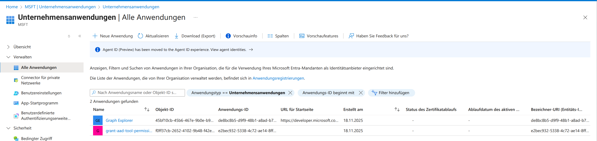
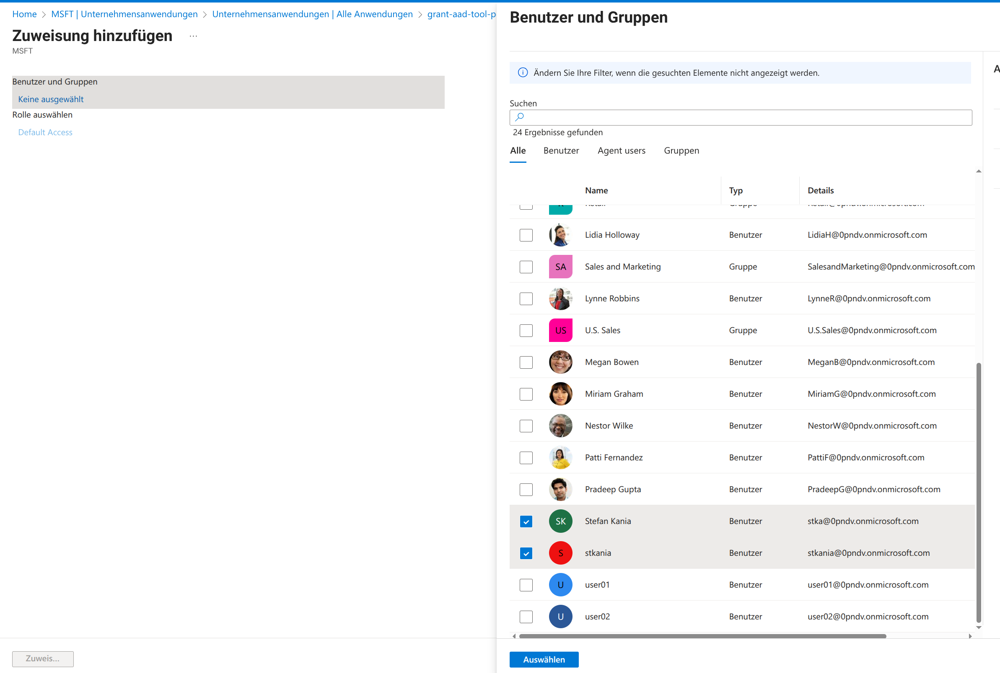
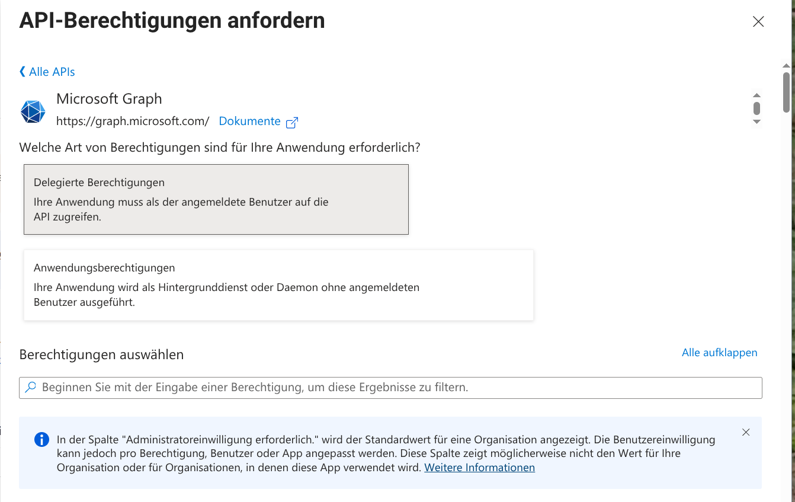
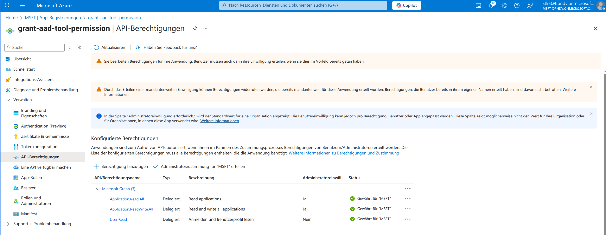
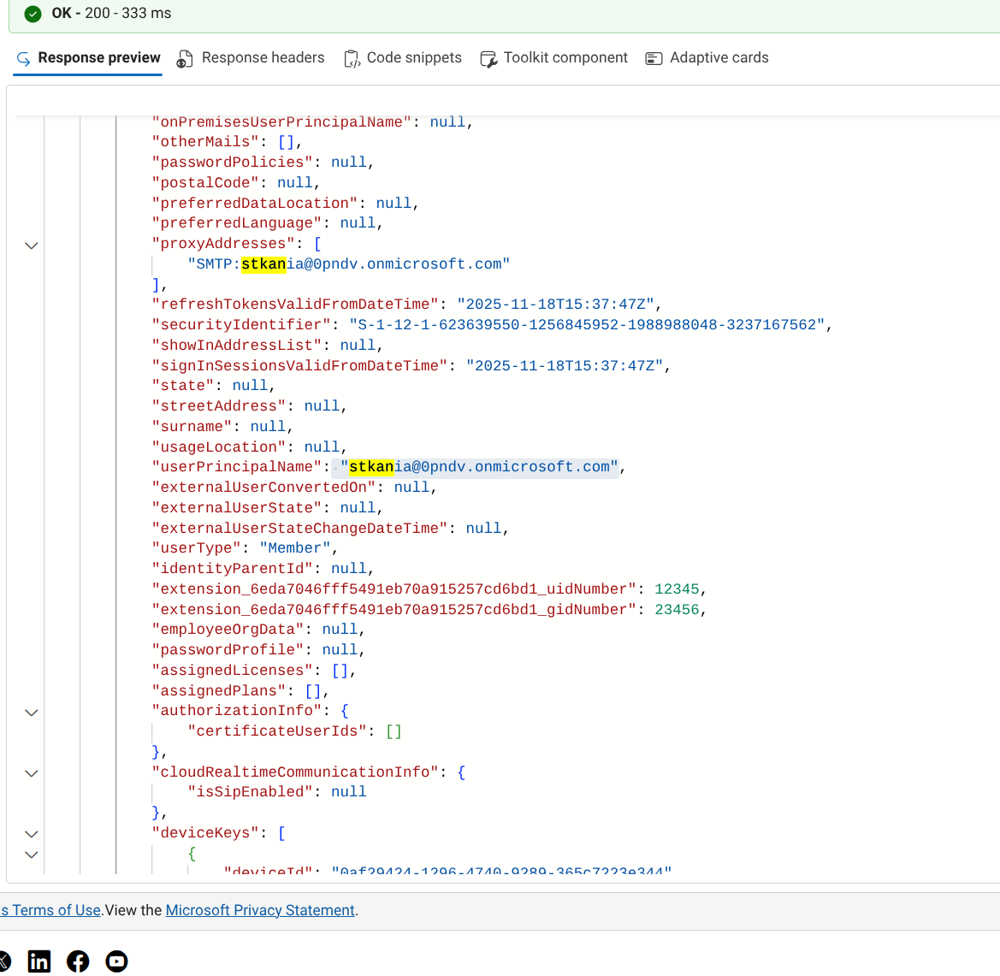

# RFC2307 Schema Attributes
*by [Stefan Kania](https://www.kania-online.de)*

There are no attributes in the user and group objects of Entra ID that
define a Unix user or a Unix group. These attributes are not provided by
Entra ID. However, if the attributes such as uidNumber or gidNumber of a
user or group from Entra ID are to be assigned fixed values, Entra ID
must be extended with the corresponding schema. The Linux systems must
then be authorized to read these new attributes. These attributes can
also be synced from an on-prem Active Directory. It is therefore not
only necessary to set up an extension of the Entra ID tenant, but all
hosts must also be granted read permission.

When is this necessary or useful?

Whenever a local domain has been converted to Entra ID and the Linux
systems have been assigned user information such as gidNumber and
uidNumber via Winbind. In this case, the uidNumber and gidNumber should
be taken from the local Active Directory if possible. Or, when setting
up Entra ID for the first time, all Linux users and groups should be
directly assigned the POSIX attributes.

However, it is not the case that users and groups from Entra ID do not
receive a uidNumber and gidNumber. By default, the uidNumber and
gidNumber are assigned by Himmelblau via the UPN name of the
authenticating user. This may seem unusual, but in Entra ID, the UPN is
the only attribute whose validity can be queried during the first
authentication, i.e., when the client joins the domain. At this point,
it is not possible to query further user attributes.

This behavior differs significantly from the behavior of a local Active
Directory. In Active Directory, the host first joins the domain. The
resulting host credentials enable directory queries for user and group
attributes, including the SID of the objects. This is not permitted in
Entra ID. After the client joins, the client still does not have
permission to perform attribute queries for users or groups.

But what happens with all subsequent authentications?

Once the client is connected, the protocol allows both the UPN and the
object ID of each authenticating user to be verified. In Windows Active
Directory, the attribute is called the SID. In Entra ID, it is referred
to as the object ID. However, both represent the same identity
attribute. For this reason, a UPN-based mapping is always required
first. This is why the SID and object ID are only available after the
client has joined the Entra ID domain.

As already described in the first part of the documentation, ID mapping
is defined using the two options *id_attr_map* and *idmap_range* in the
configuration file */etc/himmelblau/himmelblau.conf*. The option
*id_attr_map* can be compared to the option *idmap config \* :
\<backend\>* in smb.conf. The *idmap_range* option can be compared to
the *idmap config \* : \<range\>* option.

The default value for *id_attr_map* is the UPN of the object. Other
possible options are UUID or rfc2307. To use the rfc2307 option, it is
necessary to extend the schema.

The default value for idmap_range is 5000000-5999999.

But where do the default values come from when the UPN of the user is
used as *id_attr_map*? In Active Directory, together with Winbind, the
RID is used as a factor. In Himmelblau, the mapping function of *sssd*
is used to determine the uidNumber or gidNumber. The UPN is converted
into a numerical value using *murmurhash3*.

If the range is changed, it is first necessary to clear the cache for
the ID mapping and then restart the Himmelblau services. The following
listing shows the required commands:

```
root@skyblue:~# aad-tool cache-clear --full  
This will unjoin the host, clear all caches, and cannot be undone.
Proceed? \[Y/N\]: y  
success  
  
root@skyblue:~# systemctl restart himmelblaud.service
himmelblaud-tasks.service
```

As can be seen in the listing, the client is removed from the domain and
must then be re-added.

However, this is not sufficient to assign your own values for the POSIX
attributes; a schema extension is required for this. The schema
extension itself can be set up via the command line of a client
integrated into the domain. However, in order to set up the extension,
additional permissions are required in Entra ID. Permissions are
assigned via independent applications that are set up in the Entra ID
portal.

Creating the applications:

After logging into the portal, click on App Registration and then on New
Registration. The following figure shows the values entered:


You can choose any name for the application. When selecting the
"Supported account types," it is essential to ensure that the option
"Only accounts in this organizational unit..." is selected. An incorrect
selection could result in the application being visible and usable by
all Entra ID users.

The "Redirect URI" is still missing. Here, select "Public
client/native...". The URL must be
<https://login.microsoftonline.com/common/oauth2/nativeclient>.

After clicking on Register, an overview of all currently available
applications is displayed.



You can then return to the main menu and click on the Enterprise
Applications menu item on the left-hand side. This will display an
overview of all currently available applications. Clicking on the newly
created application will display the content shown in the following
figure:


Clicking on Properties under the heading Manage displays the settings
options for the application. It is essential that the item "Assignment
required" is set to "Yes." The following illustration shows the change:


Without this change, any user could use the application later. However,
the application should only be available to administrators. Next, click
on Users and Groups to select the authorized users or groups. Now click
on Add Users/Groups. The display that appears is initially empty. Only
after clicking on None selected on the left side under the heading
"Users and Groups" will an overview of all existing users and groups be
displayed. Here, you can now select multiple users and/or groups that
should later have access to the application. The following illustration
shows the selection:



Now there is an application that can only be used by selected users or
groups, but which does not yet have any permissions. Each authorized
user should be able to read and write the POSIX attributes later. This
requires the appropriate permissions in "Microsoft Graph." "Microsoft
Graph" is comparable to an LDAP. Basically, all that is happening here
is the assignment of ACLs for access to an LDAP. The assignment of
permissions follows in the next steps.

To assign permissions, select the new application again under the main
menu item "App Registration." Clicking on API Permissions will bring up
an overview of all permissions assigned to the application. This list is
currently empty. Clicking on Add Permission will open a new window on
the right-hand side. Select the top item, Microsoft Graph:


A new window appears in which you then click on Delegated Permissions.
In the following window from the image below:



Now select the following three permissions using the "Select permission"
search:  

- Application.Read.All

- Application.ReadWrite.All

- User.Read

After confirming all permissions, the window with the overview of all
permissions reappears. However, the status of the permissions is still
marked with a yellow exclamation mark. All permissions must first be
confirmed before they take effect. To confirm the new permissions, click
on Grant administrator approval for ...

The following figure shows the result of the customized application
permission:



Only now can a second application be created, which then extends the
schema with the rfc2307 attributes. The second application is now
created via the command line of a Linux client that is already a member
of the domain. All of the following commands are always executed as the
*root* user.

The schema extension is also entered via an application. Since certain
users or groups have already been granted permission to create
applications, the additional application can now be created using one of
the users in Entra ID. The following listing shows how to create the
application:

```
root@skyblue:~# aad-tool application create --client-id
e2bec932-5338-4c72-ae14-8ff5143eae2d --name
stkania@0pndv.onmicrosoft.com --  
display-name "Tenant Schema Extension App" --user-read-write
--group-read-write  
stkania@0pndv.onmicrosoft.com password:    
Open your Authenticator app, and enter the number '45' to sign in.  
```

The *--client-id* option is the application ID for the application used
to access Microsoft Graph.

The --name option is used to enter one of the authorized users who is
permitted to use the application, along with their full UPN.

The *--display-name* option assigns the name for the new application.
Although the name can be freely chosen, the Microsoft default here is
*Tenant Schema Extension App*.

The *--user-read-write* and *--group-read-write* options assign the
required permissions:

- Group.ReadWrite.All

- User.ReadWrite.All

After the command has been executed without errors, the application is
now displayed in the portal in the "App Registration" overview, as shown
in the following figure:


Only now can all configured applications be listed on the command line
of the Linux client. The following listing shows all applications

```
root@himmelblau:~# aad-tool application list --client-id
e2bec932-5338-4c72-ae14-8ff5143eae2d --name
stkania@0pndv.onmicrosoft.com  
stkania@0pndv.onmicrosoft.com password:    
Open your Authenticator app, and enter the number '70' to sign in.  
{  
"value": \[  
   {  
     "id": "8df2811d-486b-4ee0-9bf7-8103ad5449af",  
     "appId": "e2bec932-5338-4c72-ae14-8ff5143eae2d",  
     "displayName": "grant-aad-tool-permission"  
   },  
   {  
     "id": "f8fb9572-be58-48a9-9384-d8fc0308b740",  
     "appId": "6eda7046-fff5-491e-b70a-915257cd6bd1",  
     "displayName": "Tenant Schema Extension App"  
   }  
\]  
}  
```

The schema cannot be extended without listing the applications. The *ID*
of the "Tenant Schema Extension App" application is required to extend
the schema.

Now the schema is extended. The following listing shows the required
command:

```
root@skyblue:~# aad-tool application add-schema-extensions --client-id
e2bec932-5338-4c72-ae14-8ff5143eae2d --name stkania@0pndv.onm  
icrosoft.com --schema-app-object-id
f8fb9572-be58-48a9-9384-d8fc0308b740  
stkania@0pndv.onmicrosoft.com password:    
Open your Authenticator app, and enter the number '87' to sign in.  
```

The --schema-app-object-id option is the *ID* of the "Tenant Schema
Extension App."

Once all permissions have been set, the POSIX attributes for groups and
users can now be set. The following examples show the extension for a
group and then the extension for a user. It is noticeable that the
object ID is used for the group and not the name of the group. The
reason for this is that there is no UPN for groups, so it could happen
that the same group name is used in different domains of a tenant. For
users, the UPN can be specified, which is unique throughout the tenant.

In order to be able to assign a *gidNumber* to a user, the example first
extends a group with the *gidNumber*. Then, in the second command, the
user can be assigned a *uidNumber* and the *gidNumber*.

```
root@himmelblau:~# aad-tool group set-posix-attrs --schema-client-id
6eda7046-fff5-491e-b70a-915257cd6bd1 --name stkania@0pndv.onmicros  
oft.com --group-id bb845f7f-8f6a-4101-b4c7-8db3cb94c9e6 --gid 23456  
stkania@0pndv.onmicrosoft.com password:    
Open your Authenticator app, and enter the number '13' to sign in.

  
root@himmelblau:~# aad-tool user set-posix-attrs --schema-client-id
6eda7046-fff5-491e-b70a-915257cd6bd1 --name stkania@0pndv.onmicroso  
ft.com --user-id stkania@0pndv.onmicrosoft.com --uid 12345 --gid 23456  
stkania@0pndv.onmicrosoft.com password:    
Open your Authenticator app, and enter the number '64' to sign in.  
```

This time, the --schema-client-id option is the *appId* of the "Tenant
Schema Extension App" application.  

Now you need to adjust the configuration. To do this, add the following
line to the file /etc/himmelblau/himmelblau.conf:

```
id_attr_map = rfc2307  
```

  
Afterwards, the cache must be cleared and the services restarted.

```  
root@skyblue:~# aad-tool cache-clear --full  
This will unjoin the host, clear all caches, and cannot be undone.
Proceed? \[Y/N\]: y  
success  
  
root@skyblue:~# systemctl restart himmelblaud.service
himmelblaud-tasks.service  
```
  
Since the new attributes cannot be read directly during the first login,
joining the domain is not possible by logging in as a user, but must be
done via a local user. The local user uses the command *aad-tool
auth-test* together with a user ID from the domain, specifically with a
user who has been granted the appropriate permissions to write to
Microsoft Graph.

The following listing shows how to join the domain using a local
account.

```
**stka@himmelblau**:**~**\$ aad-tool auth-test --name stkania  
Use the password for your Office 365 or Microsoft online login.  
Entra Id Password:    
Open your Authenticator app, and enter the number '37' to sign in.  
No push? Check your mobile device's internet connection.  
Set up a PIN  
A Hello PIN is a fast, secure way to sign in to your device, apps, and
services.  
The minimum PIN length is 6 characters.  
New PIN:    
Set up a PIN  
A Hello PIN is a fast, secure way to sign in to your device, apps, and
services.  
The minimum PIN length is 6 characters.  
Confirm PIN:    
Enrolling the Hello PIN. Please wait...

```
  
Only now can the new attributes be displayed and used, as shown in the
following listing:

```
**stka@himmelblau**:**~**\$ getent passwd stkania  
stkania:x:12345:23456:stkania:/home/stkania:/bin/bash  
```

The new attributes can also be found via the "Microsoft Graph Explorer."
But first, it is necessary to adjust the permissions for the application
*grant-aad-tool-permission* as shown in the following figure:


Now the attributes can also be displayed in Explorer. The URL for
Explorer is
<https://developer.microsoft.com/en-us/graph/graph-explorer>. The
following figure shows the new attributes of the user:


